# Design Document: VerticalBroker AWS Data Engineering Platform

## Overview

This document provides the **High-Level Design (HLD)** and **Low-Level Design (LLD)** for VerticalBroker's AWS Data Engineering Platform — a production-grade, FINRA-regulated data platform serving 200 million monthly users across three product lines (Full-Service, Self-Service, Automated-Service).

### Design Goals

| Goal | Target | Rationale |
|------|--------|-----------|
| Throughput | 100M datapoints/day (~1,157/sec avg, 12,000/sec burst) | Bloomberg B-Pipe + Thomson Reuters feeds |
| Data Estate | 10 PB managed across Bronze/Silver/Gold layers | Historical trade data + regulatory retention |
| Latency | <5s ingestion, <500ms API, <30s CDC | Real-time trading requirements |
| Availability | 99.95% API, 99.9% batch pipelines | Financial services SLA |
| Recovery | RTO 4h, RPO 1h | FINRA business continuity |
| Compliance | FINRA 4511, SEC, SOC 2 Type II | Regulatory mandate |
| Scale | 100+ AWS accounts, 200M monthly users | Enterprise growth |

### Technology Stack

- **Infrastructure**: Terraform 1.5+ with AWS Provider 5.x
- **Application Code**: Python 3.12 (Lambda, Glue PySpark, SageMaker)
- **Streaming**: Amazon Kinesis Data Streams
- **Compute**: AWS Lambda with Powertools
- **ETL**: AWS Glue with PySpark
- **Orchestration**: AWS Step Functions
- **Messaging**: Amazon EventBridge + SQS FIFO
- **Storage**: S3 (Parquet/Iceberg), DynamoDB, Neptune, OpenSearch
- **ML**: Amazon SageMaker (RL training, inference, model registry)
- **Security**: IAM, KMS, Lake Formation, Cognito, GuardDuty
- **Observability**: CloudWatch, X-Ray, CloudWatch Logs Insights


---

## Architecture

### High-Level System Architecture (HLD)

The platform is organized into **three architectural lanes** that represent distinct data flow patterns and scaling characteristics:

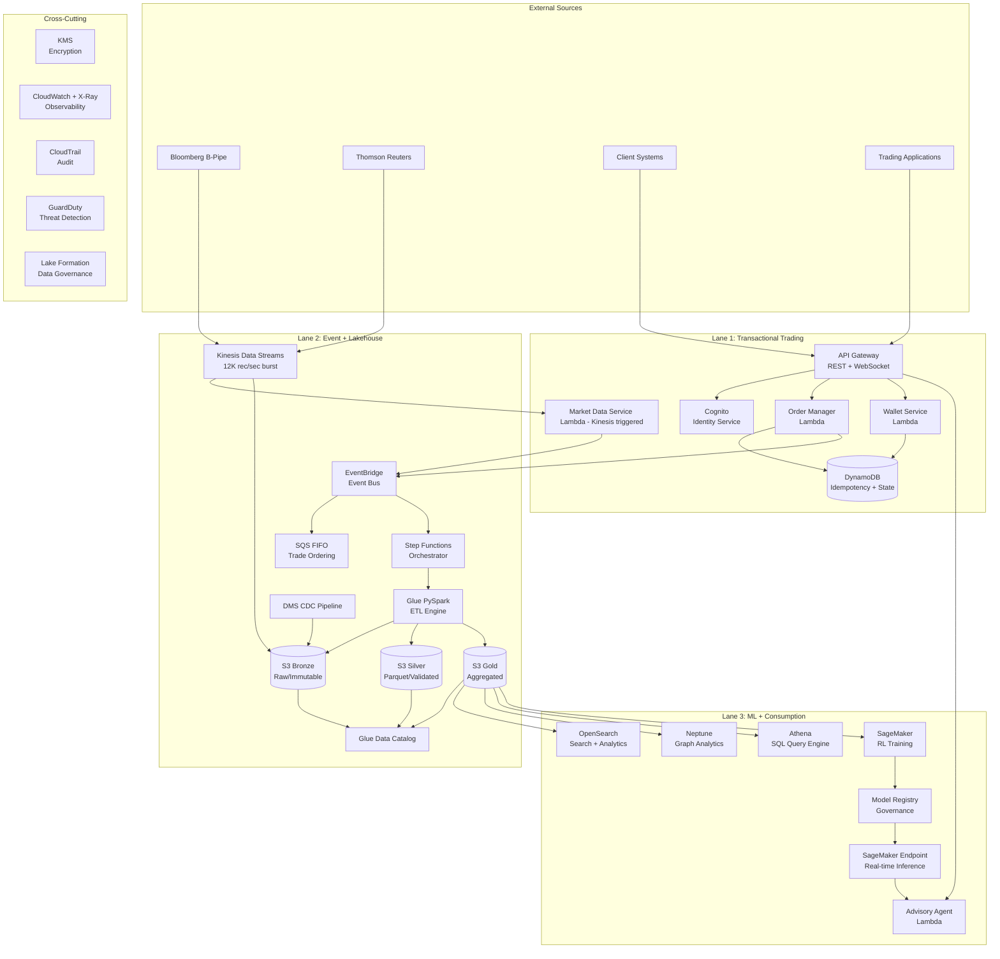


### Multi-Account Architecture

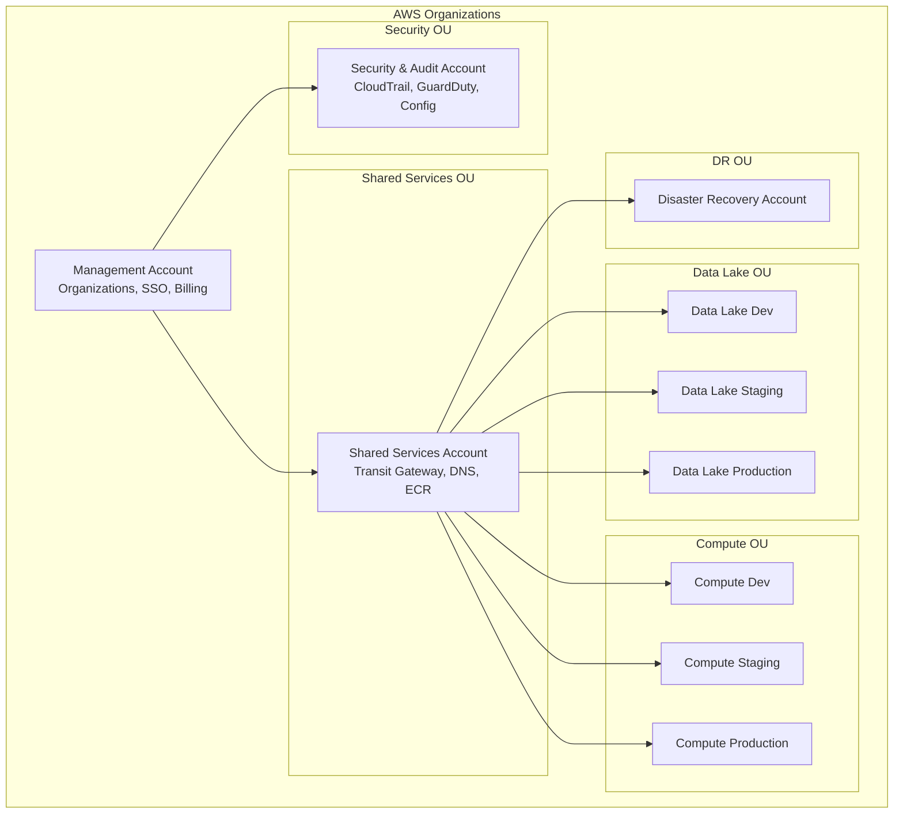

### Network Architecture (LLD)

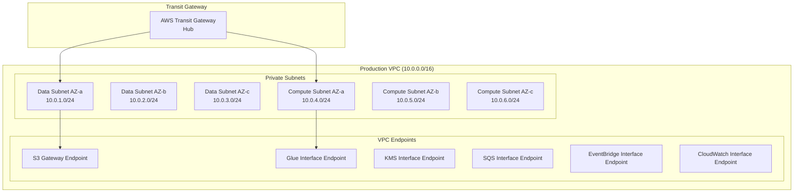

### Design Decisions

| Decision | Choice | Rationale |
|----------|--------|-----------|
| Streaming | Kinesis over Kafka | Native AWS, auto-scaling shards, lower ops overhead for burst handling |
| ETL | Glue PySpark over EMR | Serverless, auto-scaling DPUs, native Data Catalog integration |
| Table Format | Parquet + Hive partitioning | Athena-native, proven at 10PB scale, cost-effective |
| Graph DB | Neptune over Neo4j | Managed, IAM-integrated, Gremlin API for fraud detection |
| ML | SageMaker RL over custom | Managed training, built-in model registry, A/B endpoint variants |
| IaC | Terraform over CDK | Multi-cloud optionality, mature ecosystem, state management |
| Messaging | EventBridge + SQS FIFO | Schema registry, exactly-once for trades, archive for debugging |
| Auth | Cognito + IAM | Native JWT, RBAC, fine-grained resource policies |


---

## Components and Interfaces

### Lane 1: Transactional Trading Microservices

#### Market Data Ingestion Service (LLD)

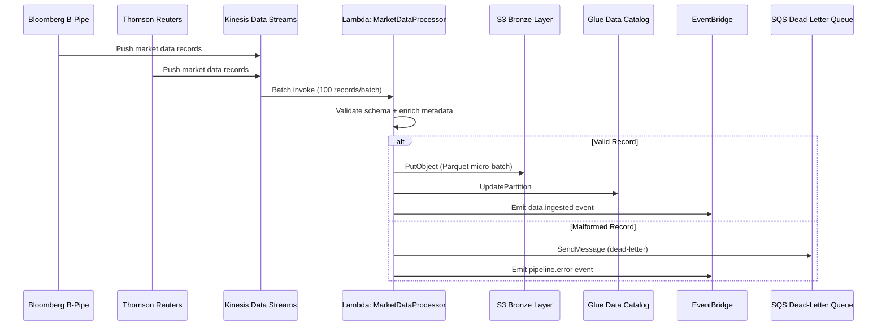

**Python Lambda Structure:**

```python
# src/services/market_data/handler.py
from aws_lambda_powertools import Logger, Tracer, Metrics
from aws_lambda_powertools.utilities.idempotency import (
    DynamoDBPersistenceLayer, idempotent_function
)
from aws_lambda_powertools.utilities.batch import (
    BatchProcessor, EventType, batch_processor
)

logger = Logger(service="market-data-ingestion")
tracer = Tracer(service="market-data-ingestion")
metrics = Metrics(namespace="VerticalBroker/MarketData")
processor = BatchProcessor(event_type=EventType.KinesisDataStreamEvent)

class MarketDataRecord:
    """Validated market data record with metadata enrichment."""
    source_id: str          # "bloomberg" | "thomson-reuters"
    instrument_id: str      # ISIN/CUSIP identifier
    timestamp: datetime     # Source timestamp (UTC)
    ingestion_ts: datetime  # Platform ingestion timestamp
    schema_version: str     # e.g., "v2.3.1"
    partition_key: str      # Derived: {source}/{instrument_type}/{date}
    payload: dict           # Raw market data fields

class MarketDataProcessor:
    """Processes Kinesis batches with validation and routing."""

    def __init__(self):
        self.s3_client = boto3.client('s3')
        self.catalog_client = boto3.client('glue')
        self.eventbridge_client = boto3.client('events')
        self.schema_registry = SchemaRegistry()

    @tracer.capture_method
    def process_record(self, record: dict) -> MarketDataRecord:
        """Validate, enrich, and route a single market data record."""
        ...

    @tracer.capture_method
    def write_micro_batch(self, records: list[MarketDataRecord]) -> str:
        """Write validated records as Parquet micro-batch to S3 Bronze."""
        ...

    @tracer.capture_method
    def register_partition(self, s3_path: str, partition_values: dict):
        """Register new partition in Glue Data Catalog."""
        ...

@logger.inject_lambda_context
@tracer.capture_lambda_handler
@metrics.log_metrics(capture_cold_start_metric=True)
def lambda_handler(event, context):
    """Kinesis stream processor entry point."""
    batch = BatchProcessor(event_type=EventType.KinesisDataStreamEvent)
    with batch(records=event["Records"], handler=record_handler):
        processed = batch.process()
    return batch.response()
```

**Kinesis Shard Calculation:**

| Parameter | Value | Calculation |
|-----------|-------|-------------|
| Average throughput | 1,157 rec/sec | 100M / 86,400 |
| Burst throughput | 12,000 rec/sec | 10x average |
| Avg record size | 1 KB | Market data payload + metadata |
| Write capacity/shard | 1,000 rec/sec or 1 MB/sec | AWS limit |
| Required shards (burst) | 12 shards | 12,000 / 1,000 |
| Provisioned shards | 16 shards | 12 + 33% headroom |
| On-demand mode | Enabled | Auto-scales beyond 16 for spikes |


#### Order Manager Service (LLD)

```python
# src/services/order_manager/handler.py
from aws_lambda_powertools import Logger, Tracer, Metrics
from aws_lambda_powertools.utilities.idempotency import (
    DynamoDBPersistenceLayer, idempotent
)
from aws_lambda_powertools.event_handler import APIGatewayHttpResolver

logger = Logger(service="order-manager")
tracer = Tracer(service="order-manager")
metrics = Metrics(namespace="VerticalBroker/Orders")
app = APIGatewayHttpResolver()

persistence_layer = DynamoDBPersistenceLayer(table_name="IdempotencyStore")

class OrderRequest:
    """Incoming order request from trading applications."""
    client_id: str
    account_id: str
    instrument_id: str        # ISIN/CUSIP
    order_type: str           # "MARKET" | "LIMIT" | "STOP" | "STOP_LIMIT"
    side: str                 # "BUY" | "SELL"
    quantity: Decimal
    limit_price: Optional[Decimal]
    stop_price: Optional[Decimal]
    time_in_force: str        # "DAY" | "GTC" | "IOC" | "FOK"
    idempotency_key: str      # Client-provided dedup key

class OrderResponse:
    """Order execution response."""
    order_id: str             # Platform-generated UUID
    status: str               # "ACCEPTED" | "REJECTED" | "PENDING"
    executed_price: Optional[Decimal]
    executed_quantity: Optional[Decimal]
    rejection_reason: Optional[str]
    timestamp: datetime

class OrderManager:
    """Handles order lifecycle: validation, execution, settlement."""

    @idempotent(persistence_store=persistence_layer)
    @tracer.capture_method
    def submit_order(self, request: OrderRequest) -> OrderResponse:
        """Submit a new order with idempotency guarantee."""
        ...

    @tracer.capture_method
    def validate_order(self, request: OrderRequest) -> ValidationResult:
        """Pre-trade validation: margin, position limits, market hours."""
        ...

    @tracer.capture_method
    def emit_trade_event(self, order: OrderResponse):
        """Publish trade.executed event to EventBridge."""
        ...

@app.post("/v1/orders")
@tracer.capture_method
def create_order():
    """POST /v1/orders - Submit new order."""
    ...

@app.get("/v1/orders/<order_id>")
@tracer.capture_method
def get_order(order_id: str):
    """GET /v1/orders/{order_id} - Retrieve order status."""
    ...

@logger.inject_lambda_context
@tracer.capture_lambda_handler
@metrics.log_metrics
def lambda_handler(event, context):
    return app.resolve(event, context)
```

#### Wallet Service (LLD)

```python
# src/services/wallet/handler.py
class WalletService:
    """Manages client account balances and positions."""

    def get_portfolio(self, client_id: str, account_id: str) -> Portfolio:
        """Retrieve current portfolio positions and cash balance."""
        ...

    def update_position(self, trade_event: TradeEvent) -> PositionUpdate:
        """Update position based on executed trade (event-driven)."""
        ...

    def check_margin(self, client_id: str, order: OrderRequest) -> MarginResult:
        """Real-time margin check before order acceptance."""
        ...

class Portfolio:
    client_id: str
    account_id: str
    cash_balance: Decimal
    positions: list[Position]
    margin_available: Decimal
    total_value: Decimal
    last_updated: datetime

class Position:
    instrument_id: str
    quantity: Decimal
    avg_cost_basis: Decimal
    current_price: Decimal
    unrealized_pnl: Decimal
    market_value: Decimal
```

#### Advisory Agent Service (LLD)

```python
# src/services/advisory_agent/handler.py
class CustomerProfile:
    """Input features for RL-based advisory model."""
    age: int
    tax_filing_status: str         # "SINGLE" | "MARRIED_JOINT" | "MARRIED_SEPARATE" | "HEAD_OF_HOUSEHOLD"
    annual_income: Decimal
    total_debt: Decimal
    household_income: Decimal
    risk_profile: str              # "CONSERVATIVE" | "MODERATE" | "AGGRESSIVE" | "VERY_AGGRESSIVE"
    investment_strategies: list[str]  # ["GROWTH", "VALUE", "INCOME", "INDEX"]
    investment_horizon_years: int
    existing_allocations: dict[str, Decimal]

class AdvisoryRecommendation:
    """Output from RL advisory model."""
    recommendation_id: str
    model_version: str
    allocations: dict[str, Decimal]   # asset_class -> percentage
    confidence_score: float            # 0.0 - 1.0
    explanation: str
    risk_metrics: RiskMetrics
    requires_human_review: bool        # True if confidence < 0.7
    uncertainty_factors: list[str]

class AdvisoryAgentService:
    """Orchestrates RL model inference with governance."""

    def __init__(self):
        self.sagemaker_runtime = boto3.client('sagemaker-runtime')
        self.endpoint_name = os.environ['SAGEMAKER_ENDPOINT']
        self.regulatory_store = RegulatoryStore()

    @tracer.capture_method
    def get_recommendation(self, profile: CustomerProfile) -> AdvisoryRecommendation:
        """Invoke SageMaker endpoint and apply governance rules."""
        response = self.sagemaker_runtime.invoke_endpoint(
            EndpointName=self.endpoint_name,
            ContentType='application/json',
            Body=json.dumps(profile.to_features())
        )
        recommendation = self._parse_response(response)
        
        # Governance: flag low-confidence recommendations
        if recommendation.confidence_score < 0.7:
            recommendation.requires_human_review = True
        
        # FINRA compliance: log all recommendations
        self.regulatory_store.log_recommendation(
            input_features=profile,
            model_version=recommendation.model_version,
            output=recommendation
        )
        return recommendation
```


### Lane 2: Event + Lakehouse Architecture

#### Event-Driven Architecture (LLD)

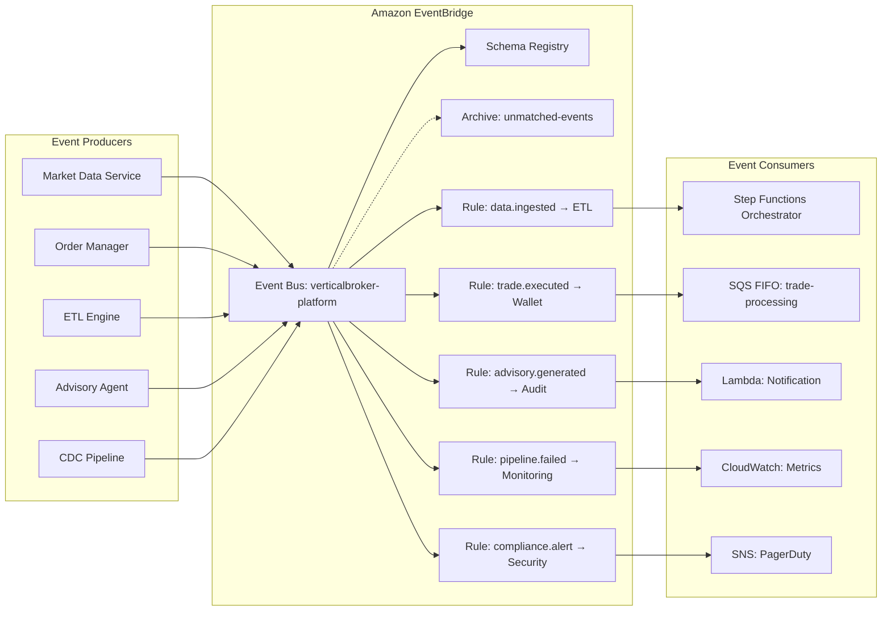

**EventBridge Event Schemas (LLD):**

```json
{
  "data.ingested": {
    "source": "verticalbroker.market-data",
    "detail-type": "MarketDataIngested",
    "detail": {
      "source_id": "string",
      "partition_path": "string",
      "record_count": "integer",
      "ingestion_timestamp": "string (ISO-8601)",
      "schema_version": "string",
      "size_bytes": "integer"
    }
  },
  "trade.executed": {
    "source": "verticalbroker.order-manager",
    "detail-type": "TradeExecuted",
    "detail": {
      "order_id": "string (UUID)",
      "client_id": "string",
      "instrument_id": "string",
      "side": "string (BUY|SELL)",
      "quantity": "number",
      "executed_price": "number",
      "execution_timestamp": "string (ISO-8601)",
      "venue": "string"
    }
  },
  "pipeline.failed": {
    "source": "verticalbroker.etl-engine",
    "detail-type": "PipelineExecutionFailed",
    "detail": {
      "job_id": "string",
      "pipeline_stage": "string (bronze-to-silver|silver-to-gold)",
      "error_type": "string",
      "error_message": "string",
      "retry_count": "integer",
      "affected_partitions": ["string"],
      "failure_timestamp": "string (ISO-8601)"
    }
  },
  "compliance.alert": {
    "source": "verticalbroker.security",
    "detail-type": "ComplianceAlert",
    "detail": {
      "alert_id": "string (UUID)",
      "severity": "string (HIGH|MEDIUM|LOW)",
      "alert_type": "string",
      "source_account": "string",
      "resource_arn": "string",
      "description": "string",
      "detection_timestamp": "string (ISO-8601)"
    }
  },
  "advisory.generated": {
    "source": "verticalbroker.advisory-agent",
    "detail-type": "AdvisoryGenerated",
    "detail": {
      "recommendation_id": "string (UUID)",
      "client_id": "string",
      "model_version": "string",
      "confidence_score": "number",
      "requires_human_review": "boolean",
      "timestamp": "string (ISO-8601)"
    }
  }
}
```

**SQS Queue Configurations (LLD):**

| Queue | Type | Visibility Timeout | Retention | Max Receive | DLQ |
|-------|------|-------------------|-----------|-------------|-----|
| trade-processing.fifo | FIFO | 30s | 14 days | 5 | trade-processing-dlq.fifo |
| market-data-buffer | Standard | 60s | 14 days | 3 | market-data-dlq |
| etl-trigger | Standard | 300s | 4 days | 3 | etl-trigger-dlq |
| advisory-requests | Standard | 30s | 4 days | 5 | advisory-dlq |
| compliance-events | FIFO | 60s | 14 days | 5 | compliance-dlq.fifo |


#### Step Functions Orchestrator (LLD)

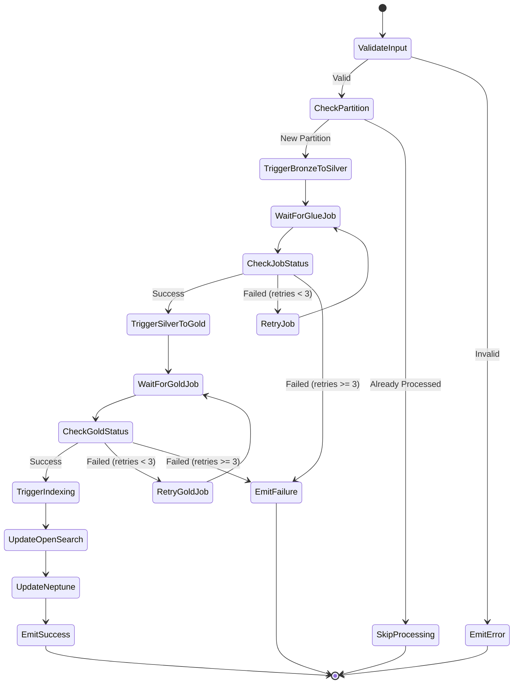

**State Machine Definition (LLD):**

```python
# src/orchestration/pipeline_state_machine.py
PIPELINE_STATE_MACHINE = {
    "Comment": "VerticalBroker ETL Pipeline Orchestrator",
    "StartAt": "ValidateInput",
    "States": {
        "ValidateInput": {
            "Type": "Task",
            "Resource": "arn:aws:lambda:{region}:{account}:function:validate-pipeline-input",
            "Next": "CheckPartition",
            "Catch": [{"ErrorEquals": ["ValidationError"], "Next": "EmitError"}]
        },
        "TriggerBronzeToSilver": {
            "Type": "Task",
            "Resource": "arn:aws:states:::glue:startJobRun.sync",
            "Parameters": {
                "JobName": "bronze-to-silver-etl",
                "Arguments": {
                    "--source_partition.$": "$.partition_path",
                    "--job_id.$": "$$.Execution.Id"
                }
            },
            "Retry": [{"ErrorEquals": ["Glue.AWSGlueException"], 
                       "IntervalSeconds": 60, "MaxAttempts": 3, "BackoffRate": 2.0}],
            "Catch": [{"ErrorEquals": ["States.ALL"], "Next": "EmitFailure"}],
            "Next": "TriggerSilverToGold"
        },
        "TriggerSilverToGold": {
            "Type": "Task",
            "Resource": "arn:aws:states:::glue:startJobRun.sync",
            "Parameters": {
                "JobName": "silver-to-gold-etl",
                "Arguments": {
                    "--source_partition.$": "$.silver_output_path",
                    "--job_id.$": "$$.Execution.Id"
                }
            },
            "Retry": [{"ErrorEquals": ["Glue.AWSGlueException"],
                       "IntervalSeconds": 60, "MaxAttempts": 3, "BackoffRate": 2.0}],
            "Catch": [{"ErrorEquals": ["States.ALL"], "Next": "EmitFailure"}],
            "Next": "TriggerIndexing"
        },
        "TriggerIndexing": {
            "Type": "Parallel",
            "Branches": [
                {"StartAt": "UpdateOpenSearch", "States": {"UpdateOpenSearch": {"Type": "Task", "Resource": "...", "End": True}}},
                {"StartAt": "UpdateNeptune", "States": {"UpdateNeptune": {"Type": "Task", "Resource": "...", "End": True}}}
            ],
            "Next": "EmitSuccess"
        }
    }
}
```


#### ETL Pipeline Architecture (LLD)

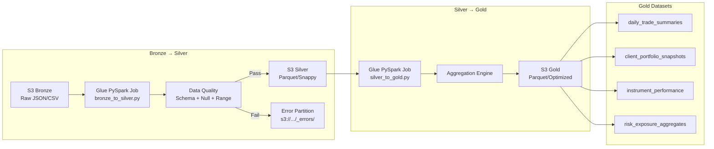

**PySpark ETL Job Structure (LLD):**

```python
# src/etl/bronze_to_silver.py
"""Bronze to Silver ETL: Cleanse, validate, deduplicate, conform."""
import sys
from awsglue.transforms import *
from awsglue.utils import getResolvedOptions
from awsglue.context import GlueContext
from awsglue.job import Job
from awsglue.dynamicframe import DynamicFrame
from pyspark.sql import SparkSession, functions as F
from pyspark.sql.types import StructType

class BronzeToSilverETL:
    """Transforms raw Bronze data into validated Silver layer."""

    def __init__(self, glue_context: GlueContext, job_args: dict):
        self.glue_context = glue_context
        self.spark = glue_context.spark_session
        self.source_partition = job_args['source_partition']
        self.job_id = job_args['job_id']
        self.metrics = PipelineMetrics()

    def extract(self) -> DynamicFrame:
        """Read raw data from Bronze S3 partition."""
        return self.glue_context.create_dynamic_frame.from_catalog(
            database="verticalbroker_bronze",
            table_name="market_data_raw",
            push_down_predicate=f"partition_path = '{self.source_partition}'"
        )

    def validate_schema(self, df: DynamicFrame) -> tuple[DynamicFrame, DynamicFrame]:
        """Validate against Glue Data Catalog schema. Returns (valid, rejected)."""
        ...

    def deduplicate(self, df: DynamicFrame) -> DynamicFrame:
        """Deduplicate on composite key: instrument_id + timestamp + source."""
        spark_df = df.toDF()
        deduped = spark_df.dropDuplicates(['instrument_id', 'timestamp', 'source_id'])
        self.metrics.record_dedup_count(spark_df.count() - deduped.count())
        return DynamicFrame.fromDF(deduped, self.glue_context, "deduped")

    def apply_data_quality(self, df: DynamicFrame) -> tuple[DynamicFrame, DynamicFrame]:
        """Apply data quality rules: null checks, range validation, freshness."""
        ...

    def write_silver(self, df: DynamicFrame):
        """Write to Silver layer as Parquet with Snappy compression."""
        self.glue_context.write_dynamic_frame.from_options(
            frame=df,
            connection_type="s3",
            format="parquet",
            connection_options={
                "path": f"s3://vb-silver-{self.env}/market_data/",
                "partitionKeys": ["instrument_type", "trade_date"]
            },
            format_options={"compression": "snappy"}
        )

    def write_lineage(self, input_count: int, output_count: int, rejected_count: int):
        """Record data lineage metadata for audit trail."""
        ...

    def run(self):
        """Execute full Bronze → Silver pipeline."""
        raw = self.extract()
        valid, schema_rejected = self.validate_schema(raw)
        deduped = self.deduplicate(valid)
        quality_passed, quality_rejected = self.apply_data_quality(deduped)
        self.write_silver(quality_passed)
        self.write_lineage(raw.count(), quality_passed.count(), 
                          schema_rejected.count() + quality_rejected.count())


# src/etl/silver_to_gold.py
"""Silver to Gold ETL: Aggregate, enrich, optimize for consumption."""
class SilverToGoldETL:
    """Produces business-level Gold aggregates from Silver data."""

    def compute_daily_trade_summaries(self, silver_df) -> DataFrame:
        """Aggregate trades by instrument, date: volume, VWAP, high, low, close."""
        return silver_df.groupBy("instrument_id", "trade_date").agg(
            F.sum("quantity").alias("total_volume"),
            F.sum(F.col("price") * F.col("quantity")).alias("turnover"),
            F.max("price").alias("high"),
            F.min("price").alias("low"),
            F.last("price").alias("close"),
            F.count("*").alias("trade_count")
        ).withColumn("vwap", F.col("turnover") / F.col("total_volume"))

    def compute_client_portfolio_snapshots(self, silver_df) -> DataFrame:
        """Point-in-time portfolio state per client."""
        ...

    def compute_instrument_performance(self, silver_df) -> DataFrame:
        """Rolling performance metrics per instrument."""
        ...

    def compute_risk_exposure(self, silver_df) -> DataFrame:
        """Risk exposure aggregates by client, sector, geography."""
        ...

    def validate_referential_integrity(self, gold_dfs: dict[str, DataFrame]):
        """Cross-dataset FK validation against Glue Data Catalog."""
        ...
```

**Glue DPU Auto-Scaling Configuration:**

| Parameter | Value | Rationale |
|-----------|-------|-----------|
| Worker Type | G.2X (8 vCPU, 32 GB) | Optimized for Parquet/Snappy workloads |
| Min Workers | 10 | Baseline for 200GB daily |
| Max Workers | 100 DPU | Handle 500GB burst days |
| Auto-scaling | Enabled | Scale based on executor memory pressure |
| Job Timeout | 60 min | SLA: Bronze→Silver within 1 hour |
| Retry Attempts | 3 | Before escalation to monitoring |
| Job Bookmark | Enabled | Incremental processing, avoid reprocessing |


#### API Gateway Design (LLD)

```mermaid
graph TB
    subgraph "API Gateway (HTTP API)"
        AUTH[Cognito JWT Authorizer]
        RL[Rate Limiting<br/>10K auth / 100 unauth per sec]
        VAL[Request Validation<br/>OpenAPI 3.0 Schema]
        
        subgraph "REST Endpoints"
            V1[/v1/*]
            V2[/v2/*]
        end
        
        subgraph "WebSocket Endpoints"
            WS[wss://market-data<br/>2h connection limit]
        end
    end

    subgraph "Route Mapping"
        V1 --> |/v1/orders| OM_FN[Lambda: OrderManager]
        V1 --> |/v1/portfolio| WS_FN[Lambda: WalletService]
        V1 --> |/v1/advisory| AA_FN[Lambda: AdvisoryAgent]
        V1 --> |/v1/search| OS_FN[Lambda: SearchProxy]
        V1 --> |/v1/graph| NP_FN[Lambda: GraphQuery]
        V1 --> |/v1/query| ATH_FN[Lambda: AthenaQuery]
        WS --> |$connect| WS_CONN[Lambda: WSConnect]
        WS --> |$disconnect| WS_DISC[Lambda: WSDisconnect]
        WS --> |subscribe| WS_SUB[Lambda: WSSubscribe]
    end

    AUTH --> RL --> VAL --> V1
    AUTH --> RL --> VAL --> V2
    AUTH --> WS
```

**API Endpoint Specifications:**

| Endpoint | Method | Auth | Rate Limit | Timeout | Description |
|----------|--------|------|------------|---------|-------------|
| `/v1/orders` | POST | JWT | 10K/sec | 30s | Submit trade order |
| `/v1/orders/{id}` | GET | JWT | 10K/sec | 30s | Get order status |
| `/v1/portfolio/{client_id}` | GET | JWT | 10K/sec | 30s | Get portfolio snapshot |
| `/v1/advisory` | POST | JWT | 5K/sec | 30s | Get RL recommendation |
| `/v1/search` | POST | JWT | 10K/sec | 30s | Full-text search |
| `/v1/graph/query` | POST | JWT | 1K/sec | 30s | Graph traversal query |
| `/v1/query/execute` | POST | JWT | 1K/sec | 30s | Execute Athena query |
| `/v1/query/{id}/results` | GET | JWT | 10K/sec | 30s | Get query results |
| `wss://market-data` | WebSocket | JWT | 5K conn | 2h max | Real-time market stream |

**API Versioning Strategy:**
- Path-based routing: `/v1/`, `/v2/`
- Deprecation period: 6 months with `Sunset` header
- Breaking changes increment major version
- Non-breaking additions within same version

### Lane 3: ML + Consumption Architecture

#### SageMaker RL Training Pipeline (LLD)

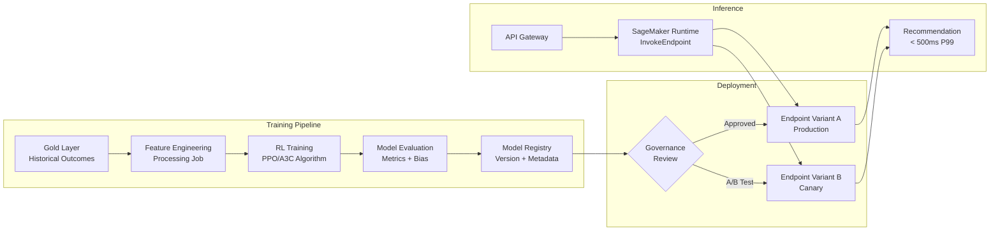

**SageMaker Pipeline Structure (LLD):**

```python
# src/ml/training_pipeline.py
"""SageMaker RL Training Pipeline for Advisory Agent."""
import sagemaker
from sagemaker.rl import RLEstimator
from sagemaker.model_monitor import ModelMonitor
from sagemaker.workflow.pipeline import Pipeline
from sagemaker.workflow.steps import TrainingStep, ProcessingStep, ModelStep

class AdvisoryModelPipeline:
    """End-to-end ML pipeline: feature eng → train → evaluate → register."""

    def __init__(self, role: str, region: str):
        self.session = sagemaker.Session()
        self.role = role
        self.model_package_group = "verticalbroker-advisory-models"

    def create_feature_engineering_step(self) -> ProcessingStep:
        """Extract features from Gold layer historical data."""
        ...

    def create_training_step(self) -> TrainingStep:
        """Train RL model using PPO algorithm."""
        estimator = RLEstimator(
            entry_point="train_advisory.py",
            source_dir="src/ml/rl_training/",
            role=self.role,
            framework="ray",
            framework_version="2.6.0",
            instance_type="ml.p3.2xlarge",
            instance_count=1,
            hyperparameters={
                "algorithm": "PPO",
                "learning_rate": 0.0003,
                "gamma": 0.99,
                "num_episodes": 10000,
                "batch_size": 256
            }
        )
        return TrainingStep(name="TrainAdvisoryModel", estimator=estimator)

    def create_evaluation_step(self) -> ProcessingStep:
        """Evaluate model: performance, bias detection, fairness metrics."""
        ...

    def create_registration_step(self) -> ModelStep:
        """Register model with governance metadata."""
        ...

    def create_pipeline(self) -> Pipeline:
        """Assemble full training pipeline."""
        return Pipeline(
            name="verticalbroker-advisory-training",
            steps=[
                self.create_feature_engineering_step(),
                self.create_training_step(),
                self.create_evaluation_step(),
                self.create_registration_step()
            ]
        )

# src/ml/model_governance.py
class ModelGovernance:
    """Pre-deployment governance checks for FINRA compliance."""

    def check_bias(self, model_artifact: str, test_data: str) -> BiasReport:
        """Detect bias across demographic groups (age, income, filing status)."""
        ...

    def generate_explainability(self, model_artifact: str) -> ExplainabilityReport:
        """SHAP-based feature importance for regulatory transparency."""
        ...

    def validate_fairness_metrics(self, predictions: DataFrame) -> FairnessResult:
        """Ensure equitable recommendations across protected classes."""
        ...

    def approve_for_deployment(self, model_version: str, reports: dict) -> bool:
        """Final governance gate before production deployment."""
        ...
```


#### Analytics Services (LLD)

**OpenSearch Index Mappings:**

```json
{
  "trade_records": {
    "settings": {
      "number_of_shards": 12,
      "number_of_replicas": 2,
      "codec": "best_compression",
      "refresh_interval": "30s"
    },
    "mappings": {
      "properties": {
        "trade_id": {"type": "keyword"},
        "client_id": {"type": "keyword"},
        "instrument_id": {"type": "keyword"},
        "instrument_name": {"type": "text", "analyzer": "standard"},
        "side": {"type": "keyword"},
        "quantity": {"type": "double"},
        "price": {"type": "double"},
        "total_value": {"type": "double"},
        "execution_timestamp": {"type": "date", "format": "strict_date_optional_time"},
        "settlement_date": {"type": "date"},
        "venue": {"type": "keyword"},
        "account_type": {"type": "keyword"},
        "@timestamp": {"type": "date"}
      }
    }
  },
  "client_profiles": {
    "settings": {
      "number_of_shards": 6,
      "number_of_replicas": 2
    },
    "mappings": {
      "properties": {
        "client_id": {"type": "keyword"},
        "name": {"type": "text", "fields": {"keyword": {"type": "keyword"}}},
        "account_ids": {"type": "keyword"},
        "risk_profile": {"type": "keyword"},
        "advisor_id": {"type": "keyword"},
        "account_type": {"type": "keyword"},
        "kyc_status": {"type": "keyword"},
        "created_date": {"type": "date"},
        "last_activity": {"type": "date"}
      }
    }
  }
}
```

**OpenSearch Index State Management Policy:**

| Phase | Duration | Storage | Action |
|-------|----------|---------|--------|
| Hot | 0-30 days | r6g.2xlarge data nodes | Full indexing, real-time search |
| Warm | 30-90 days | UltraWarm (S3-backed) | Read-only, reduced cost |
| Cold | 90 days - 7 years | Cold storage | Compliance retention, on-demand rehydration |
| Delete | >7 years | N/A | Automatic deletion per FINRA policy |

**Neptune Graph Data Model (LLD):**

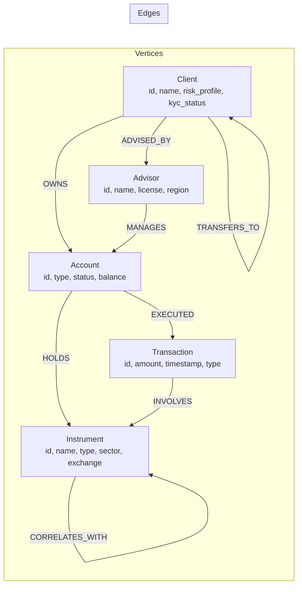

**Neptune Vertex/Edge Properties:**

```python
# src/analytics/graph_model.py
"""Neptune graph data model definitions."""

class ClientVertex:
    label = "Client"
    properties = {
        "client_id": str,         # Primary key
        "name": str,
        "risk_profile": str,      # CONSERVATIVE|MODERATE|AGGRESSIVE|VERY_AGGRESSIVE
        "kyc_status": str,        # VERIFIED|PENDING|FLAGGED
        "account_type": str,      # FULL_SERVICE|SELF_SERVICE|AUTOMATED
        "onboarding_date": datetime,
        "total_aum": Decimal,     # Assets Under Management
    }

class AccountVertex:
    label = "Account"
    properties = {
        "account_id": str,
        "account_type": str,      # INDIVIDUAL|JOINT|IRA|401K|TRUST
        "status": str,            # ACTIVE|FROZEN|CLOSED
        "cash_balance": Decimal,
        "margin_enabled": bool,
        "created_date": datetime,
    }

class InstrumentVertex:
    label = "Instrument"
    properties = {
        "instrument_id": str,     # ISIN/CUSIP
        "name": str,
        "type": str,              # EQUITY|BOND|OPTION|ETF|MUTUAL_FUND
        "sector": str,
        "exchange": str,
        "currency": str,
    }

class TransactionEdge:
    label = "EXECUTED"
    from_vertex = "Account"
    to_vertex = "Transaction"
    properties = {
        "timestamp": datetime,
        "side": str,              # BUY|SELL
        "quantity": Decimal,
        "price": Decimal,
        "fees": Decimal,
    }

# Fraud detection patterns
FRAUD_QUERIES = {
    "circular_transactions": """
        g.V().hasLabel('Client').as('start')
         .out('OWNS').out('EXECUTED').out('INVOLVES')
         .in('EXECUTED').in('OWNS')
         .where(eq('start'))
         .path()
    """,
    "rapid_transfers": """
        g.V().hasLabel('Client').as('c')
         .outE('TRANSFERS_TO')
         .has('timestamp', gte(now_minus_1h))
         .group().by(select('c'))
         .unfold()
         .where(select(values).count(local).is(gt(10)))
    """,
    "unusual_velocity": """
        g.V().hasLabel('Client')
         .out('OWNS').outE('EXECUTED')
         .has('timestamp', gte(now_minus_24h))
         .group().by(inV().values('client_id'))
         .unfold()
         .where(select(values).count(local).is(gt(stddev_threshold)))
    """
}
```


---

## Data Models

### Market Data Event Schema (Bronze Layer)

```python
# src/models/market_data.py
"""Market data schemas for Bronze/Silver/Gold layers."""
from dataclasses import dataclass
from datetime import datetime
from decimal import Decimal
from typing import Optional

@dataclass
class MarketDataRaw:
    """Bronze layer: raw market data as received from source."""
    source_id: str                    # "bloomberg_bpipe" | "thomson_reuters"
    instrument_id: str                # ISIN or CUSIP
    instrument_name: str
    instrument_type: str              # EQUITY | BOND | OPTION | ETF | FUTURES
    exchange: str                     # NYSE | NASDAQ | LSE | etc.
    
    # Price data
    bid_price: Decimal
    ask_price: Decimal
    last_price: Decimal
    volume: int
    
    # Timestamps
    source_timestamp: datetime        # When source generated the tick
    ingestion_timestamp: datetime     # When platform received it
    
    # Metadata (enriched at ingestion)
    schema_version: str               # "v2.3.1"
    partition_key: str                # "{source}/{instrument_type}/{date}"
    sequence_number: str              # Kinesis sequence for ordering
    shard_id: str                     # Source Kinesis shard
    
    # Quality markers
    is_delayed: bool                  # True if delayed quote
    market_status: str                # PRE_MARKET | OPEN | CLOSED | AFTER_HOURS

@dataclass
class MarketDataSilver:
    """Silver layer: validated, deduplicated, schema-enforced."""
    instrument_id: str
    instrument_type: str
    trade_date: str                   # Partition key: YYYY-MM-DD
    
    bid_price: Decimal
    ask_price: Decimal
    last_price: Decimal
    mid_price: Decimal                # Computed: (bid + ask) / 2
    spread: Decimal                   # Computed: ask - bid
    volume: int
    
    source_timestamp: datetime
    processing_job_id: str            # Lineage: which Glue job produced this
    quality_score: float              # 0.0 - 1.0 from data quality checks
    dedup_key: str                    # Hash of instrument_id + timestamp + source

@dataclass
class DailyTradeSummaryGold:
    """Gold layer: daily aggregated trade summary per instrument."""
    instrument_id: str
    instrument_name: str
    trade_date: str
    
    open_price: Decimal
    high_price: Decimal
    low_price: Decimal
    close_price: Decimal
    vwap: Decimal                     # Volume-weighted average price
    
    total_volume: int
    trade_count: int
    turnover: Decimal                 # price * quantity summed
    
    # Derived metrics
    daily_return_pct: Decimal
    volatility_20d: Decimal           # 20-day rolling volatility
    avg_spread: Decimal
    
    # Metadata
    last_updated: datetime
    source_record_count: int
    quality_score: float
```

### Trade Event Schema

```python
# src/models/trade.py
"""Trade lifecycle data models."""

@dataclass
class TradeEvent:
    """Canonical trade event flowing through the platform."""
    trade_id: str                     # UUID
    order_id: str                     # Parent order UUID
    client_id: str
    account_id: str
    
    # Instrument
    instrument_id: str                # ISIN/CUSIP
    instrument_type: str
    
    # Execution details
    side: str                         # BUY | SELL
    quantity: Decimal
    executed_price: Decimal
    total_value: Decimal              # quantity * price
    fees: Decimal
    net_value: Decimal                # total_value +/- fees
    
    # Timing
    order_timestamp: datetime
    execution_timestamp: datetime
    settlement_date: str              # T+1 or T+2
    
    # Routing
    venue: str                        # Exchange or dark pool
    execution_type: str               # MARKET | LIMIT | STOP
    
    # Compliance
    compliance_flags: list[str]       # Any flags raised
    regulatory_report_id: Optional[str]

@dataclass
class ClientProfile:
    """Client profile for advisory and portfolio services."""
    client_id: str
    
    # Demographics
    name: str
    age: int
    tax_filing_status: str
    state_of_residence: str
    
    # Financial
    annual_income: Decimal
    total_debt: Decimal
    household_income: Decimal
    net_worth: Decimal
    
    # Investment profile
    risk_profile: str                 # CONSERVATIVE | MODERATE | AGGRESSIVE | VERY_AGGRESSIVE
    investment_strategies: list[str]  # GROWTH | VALUE | INCOME | INDEX
    investment_horizon_years: int
    experience_level: str             # NOVICE | INTERMEDIATE | ADVANCED | EXPERT
    
    # Account relationship
    account_ids: list[str]
    advisor_id: Optional[str]
    service_tier: str                 # FULL_SERVICE | SELF_SERVICE | AUTOMATED
    
    # Compliance
    kyc_status: str                   # VERIFIED | PENDING | FLAGGED
    accredited_investor: bool
    pep_status: bool                  # Politically Exposed Person
    last_review_date: datetime
```

### Terraform Module Hierarchy (LLD)

```
terraform/
├── modules/
│   ├── networking/
│   │   ├── main.tf              # VPC, subnets, route tables, NAT
│   │   ├── transit_gateway.tf   # TGW, attachments, route tables
│   │   ├── vpc_endpoints.tf     # S3, Glue, KMS, SQS, EB, CW endpoints
│   │   ├── security_groups.tf   # SG rules (deny-by-default)
│   │   ├── variables.tf
│   │   └── outputs.tf
│   ├── data-lake/
│   │   ├── s3_buckets.tf        # Bronze/Silver/Gold buckets
│   │   ├── lifecycle.tf         # Intelligent-Tiering, Glacier policies
│   │   ├── encryption.tf        # KMS keys per classification level
│   │   ├── replication.tf       # CRR to DR region
│   │   ├── glue_catalog.tf      # Databases, tables, crawlers
│   │   ├── glue_jobs.tf         # ETL job definitions
│   │   ├── lake_formation.tf    # Data governance permissions
│   │   ├── variables.tf
│   │   └── outputs.tf
│   ├── compute/
│   │   ├── lambda_functions.tf  # All Lambda function definitions
│   │   ├── lambda_layers.tf     # Shared dependency layers
│   │   ├── api_gateway.tf       # HTTP API + WebSocket API
│   │   ├── cognito.tf           # User pool, identity pool
│   │   ├── step_functions.tf    # State machine definitions
│   │   ├── variables.tf
│   │   └── outputs.tf
│   ├── analytics/
│   │   ├── opensearch.tf        # Domain, access policies, ISM
│   │   ├── neptune.tf           # Cluster, instances, subnet group
│   │   ├── athena.tf            # Workgroups, named queries
│   │   ├── variables.tf
│   │   └── outputs.tf
│   ├── streaming/
│   │   ├── kinesis.tf           # Data streams, shard config
│   │   ├── eventbridge.tf       # Event bus, rules, schema registry
│   │   ├── sqs.tf              # Queues, DLQs, FIFO config
│   │   ├── dms.tf              # CDC replication tasks
│   │   ├── variables.tf
│   │   └── outputs.tf
│   ├── ml/
│   │   ├── sagemaker.tf         # Domain, endpoints, model registry
│   │   ├── sagemaker_pipelines.tf
│   │   ├── variables.tf
│   │   └── outputs.tf
│   ├── security/
│   │   ├── iam_roles.tf         # Service roles (least-privilege)
│   │   ├── iam_policies.tf      # Custom policies per service
│   │   ├── kms_keys.tf          # CMKs per classification
│   │   ├── guardduty.tf         # Threat detection
│   │   ├── security_hub.tf      # Compliance standards
│   │   ├── cloudtrail.tf        # Audit trail
│   │   ├── config_rules.tf      # AWS Config conformance
│   │   ├── variables.tf
│   │   └── outputs.tf
│   └── monitoring/
│       ├── cloudwatch.tf        # Dashboards, alarms, log groups
│       ├── xray.tf              # Tracing configuration
│       ├── sns.tf               # Notification topics
│       ├── ssm_automation.tf    # Automated runbooks
│       ├── budgets.tf           # Cost alerts
│       ├── variables.tf
│       └── outputs.tf
├── environments/
│   ├── dev/
│   │   ├── main.tf
│   │   ├── terraform.tfvars
│   │   └── backend.tf
│   ├── staging/
│   │   ├── main.tf
│   │   ├── terraform.tfvars
│   │   └── backend.tf
│   ├── production/
│   │   ├── main.tf
│   │   ├── terraform.tfvars
│   │   └── backend.tf
│   └── dr/
│       ├── main.tf
│       ├── terraform.tfvars
│       └── backend.tf
├── global/
│   ├── organizations.tf         # AWS Organizations, SCPs
│   ├── baseline_security.tf     # Account-level baselines
│   └── transit_gateway.tf       # Cross-account networking
└── terragrunt.hcl               # DRY configuration management
```


### IAM Policy Structures (LLD - Least Privilege)

```python
# Terraform IAM policy definitions (represented as Python dicts for clarity)

# Market Data Ingestion Lambda Role
MARKET_DATA_LAMBDA_POLICY = {
    "Version": "2012-10-17",
    "Statement": [
        {
            "Sid": "KinesisRead",
            "Effect": "Allow",
            "Action": [
                "kinesis:GetRecords",
                "kinesis:GetShardIterator",
                "kinesis:DescribeStream",
                "kinesis:ListShards"
            ],
            "Resource": "arn:aws:kinesis:{region}:{account}:stream/vb-market-data-*"
        },
        {
            "Sid": "S3BronzeWrite",
            "Effect": "Allow",
            "Action": ["s3:PutObject", "s3:PutObjectTagging"],
            "Resource": "arn:aws:s3:::vb-bronze-{env}/*"
        },
        {
            "Sid": "GlueCatalogUpdate",
            "Effect": "Allow",
            "Action": ["glue:UpdatePartition", "glue:BatchCreatePartition"],
            "Resource": [
                "arn:aws:glue:{region}:{account}:catalog",
                "arn:aws:glue:{region}:{account}:database/verticalbroker_bronze",
                "arn:aws:glue:{region}:{account}:table/verticalbroker_bronze/*"
            ]
        },
        {
            "Sid": "EventBridgePut",
            "Effect": "Allow",
            "Action": ["events:PutEvents"],
            "Resource": "arn:aws:events:{region}:{account}:event-bus/verticalbroker-platform"
        },
        {
            "Sid": "SQSDLQWrite",
            "Effect": "Allow",
            "Action": ["sqs:SendMessage"],
            "Resource": "arn:aws:sqs:{region}:{account}:market-data-dlq"
        },
        {
            "Sid": "KMSDecryptEncrypt",
            "Effect": "Allow",
            "Action": ["kms:Decrypt", "kms:GenerateDataKey"],
            "Resource": "arn:aws:kms:{region}:{account}:key/{bronze-key-id}"
        },
        {
            "Sid": "DynamoDBIdempotency",
            "Effect": "Allow",
            "Action": ["dynamodb:PutItem", "dynamodb:GetItem", "dynamodb:DeleteItem"],
            "Resource": "arn:aws:dynamodb:{region}:{account}:table/IdempotencyStore"
        }
    ]
}

# ETL Glue Job Role
ETL_GLUE_ROLE_POLICY = {
    "Version": "2012-10-17",
    "Statement": [
        {
            "Sid": "S3ReadBronzeSilver",
            "Effect": "Allow",
            "Action": ["s3:GetObject", "s3:ListBucket"],
            "Resource": [
                "arn:aws:s3:::vb-bronze-{env}",
                "arn:aws:s3:::vb-bronze-{env}/*",
                "arn:aws:s3:::vb-silver-{env}",
                "arn:aws:s3:::vb-silver-{env}/*"
            ]
        },
        {
            "Sid": "S3WriteSilverGold",
            "Effect": "Allow",
            "Action": ["s3:PutObject", "s3:DeleteObject"],
            "Resource": [
                "arn:aws:s3:::vb-silver-{env}/*",
                "arn:aws:s3:::vb-gold-{env}/*"
            ]
        },
        {
            "Sid": "GlueCatalogFull",
            "Effect": "Allow",
            "Action": ["glue:*Partition*", "glue:GetTable", "glue:GetDatabase"],
            "Resource": [
                "arn:aws:glue:{region}:{account}:catalog",
                "arn:aws:glue:{region}:{account}:database/verticalbroker_*",
                "arn:aws:glue:{region}:{account}:table/verticalbroker_*/*"
            ]
        },
        {
            "Sid": "CloudWatchLogs",
            "Effect": "Allow",
            "Action": ["logs:CreateLogGroup", "logs:CreateLogStream", "logs:PutLogEvents"],
            "Resource": "arn:aws:logs:{region}:{account}:log-group:/aws-glue/*"
        }
    ]
}

# Advisory Agent Lambda Role
ADVISORY_AGENT_POLICY = {
    "Version": "2012-10-17",
    "Statement": [
        {
            "Sid": "SageMakerInvoke",
            "Effect": "Allow",
            "Action": ["sagemaker:InvokeEndpoint"],
            "Resource": "arn:aws:sagemaker:{region}:{account}:endpoint/vb-advisory-*"
        },
        {
            "Sid": "RegulatoryStoreWrite",
            "Effect": "Allow",
            "Action": ["s3:PutObject"],
            "Resource": "arn:aws:s3:::vb-regulatory-store-{env}/advisory-logs/*",
            "Condition": {
                "StringEquals": {"s3:x-amz-object-lock-mode": "COMPLIANCE"}
            }
        },
        {
            "Sid": "ParameterStoreRead",
            "Effect": "Allow",
            "Action": ["ssm:GetParameter", "ssm:GetParametersByPath"],
            "Resource": "arn:aws:ssm:{region}:{account}:parameter/verticalbroker/advisory/*"
        }
    ]
}
```

### Security Architecture (HLD)

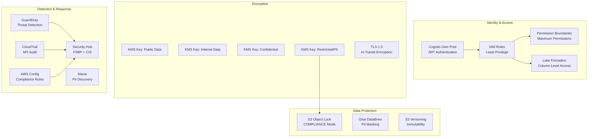

### CDC Pipeline Design (LLD)

```python
# src/services/cdc/schema_evolution.py
"""CDC Pipeline: Schema evolution detection and handling."""

class CDCPipelineConfig:
    """DMS replication task configuration."""
    source_endpoint: str          # Source RDS/Aurora endpoint
    target_endpoint: str          # S3 Bronze target
    replication_instance: str     # dms.r6i.2xlarge
    migration_type: str           # "full-load-and-cdc" | "cdc" | "full-load"
    
    # CDC settings
    cdc_start_position: str       # "server-time" or LSN
    max_lag_seconds: int = 60     # Alert threshold
    batch_apply_enabled: bool = True
    batch_size: int = 1000
    
    # Table mappings
    table_mappings: dict = {
        "rules": [
            {
                "rule-type": "selection",
                "rule-id": "1",
                "rule-action": "include",
                "object-locator": {
                    "schema-name": "trading",
                    "table-name": "%"
                }
            }
        ]
    }

class SchemaEvolutionHandler:
    """Detect and handle DDL changes from source systems."""
    
    def detect_schema_change(self, event: dict) -> Optional[SchemaChange]:
        """Parse DMS event for DDL changes."""
        ...
    
    def update_glue_catalog(self, change: SchemaChange):
        """Propagate schema change to Glue Data Catalog."""
        ...
    
    def notify_downstream(self, change: SchemaChange):
        """Emit schema.evolved event for downstream consumers."""
        ...

class CDCRecord:
    """Individual CDC record with before/after images."""
    operation: str              # INSERT | UPDATE | DELETE
    schema_name: str
    table_name: str
    before_image: Optional[dict]  # Previous row state (UPDATE/DELETE)
    after_image: Optional[dict]   # New row state (INSERT/UPDATE)
    transaction_id: str
    commit_timestamp: datetime
    source_lsn: str              # Log Sequence Number
```


---

## Error Handling

### Reliability Patterns Architecture

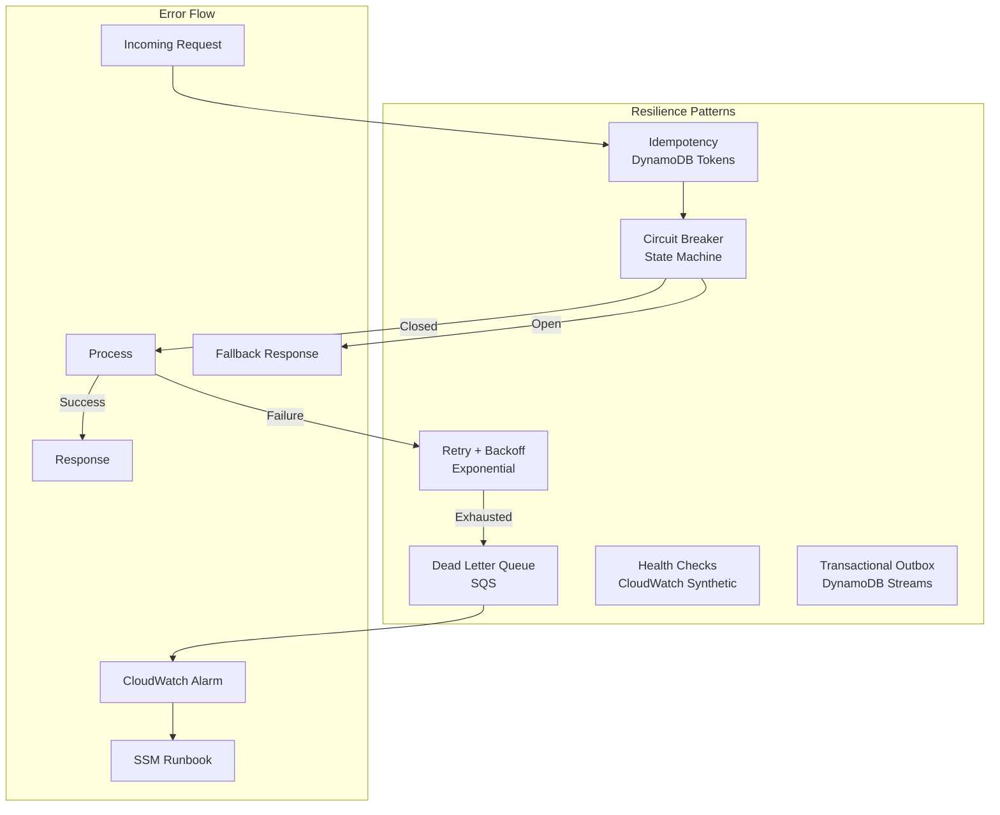

### Idempotency Pattern (LLD)

```python
# src/common/idempotency.py
"""DynamoDB-based idempotency implementation using Lambda Powertools."""
from aws_lambda_powertools.utilities.idempotency import (
    DynamoDBPersistenceLayer,
    IdempotencyConfig,
    idempotent_function
)

# DynamoDB Table Schema:
# PK: idempotency_key (string) - Client-provided or derived key
# TTL: expiration (number) - Auto-cleanup after 24 hours
# status: INPROGRESS | COMPLETED | EXPIRED
# data: Cached response (compressed JSON)
# in_progress_expiration: Lock timeout (prevents zombie locks)

persistence_layer = DynamoDBPersistenceLayer(
    table_name="IdempotencyStore",
    key_attr="idempotency_key",
    expiry_attr="expiration",
    status_attr="status",
    data_attr="data",
    in_progress_expiry_attr="in_progress_expiration"
)

config = IdempotencyConfig(
    expires_after_seconds=86400,          # 24h TTL
    use_local_cache=True,                  # In-memory cache for hot path
    local_cache_max_items=1000,
    event_key_jmespath="powertools_json(body).idempotency_key",
    raise_on_no_idempotency_key=True
)

@idempotent_function(
    data_keyword_argument="order_request",
    persistence_store=persistence_layer,
    config=config
)
def process_order(order_request: dict) -> dict:
    """Idempotent order processing - same input always returns same output."""
    # Business logic here
    ...
```

### Circuit Breaker Pattern (LLD)

```python
# src/common/circuit_breaker.py
"""Circuit breaker for downstream service calls."""
from enum import Enum
from datetime import datetime, timedelta
import boto3

class CircuitState(Enum):
    CLOSED = "closed"       # Normal operation
    OPEN = "open"           # Failing, reject requests
    HALF_OPEN = "half_open" # Testing recovery

class CircuitBreaker:
    """DynamoDB-backed circuit breaker for distributed Lambda functions."""

    def __init__(self, service_name: str, failure_threshold: int = 5,
                 recovery_timeout: int = 60, success_threshold: int = 3):
        self.service_name = service_name
        self.failure_threshold = failure_threshold
        self.recovery_timeout = timedelta(seconds=recovery_timeout)
        self.success_threshold = success_threshold
        self.dynamodb = boto3.resource('dynamodb')
        self.table = self.dynamodb.Table('CircuitBreakerState')

    def get_state(self) -> CircuitState:
        """Read current circuit state from DynamoDB."""
        item = self.table.get_item(Key={'service_name': self.service_name})
        ...

    def record_success(self):
        """Record successful call. May transition HALF_OPEN → CLOSED."""
        ...

    def record_failure(self, error: Exception):
        """Record failed call. May transition CLOSED → OPEN."""
        ...

    def can_execute(self) -> bool:
        """Check if request should be allowed through."""
        state = self.get_state()
        if state == CircuitState.CLOSED:
            return True
        elif state == CircuitState.OPEN:
            if self._recovery_timeout_elapsed():
                self._transition_to_half_open()
                return True
            return False
        elif state == CircuitState.HALF_OPEN:
            return True  # Allow probe request

    def execute(self, func, *args, **kwargs):
        """Execute function with circuit breaker protection."""
        if not self.can_execute():
            raise CircuitOpenError(f"Circuit open for {self.service_name}")
        try:
            result = func(*args, **kwargs)
            self.record_success()
            return result
        except Exception as e:
            self.record_failure(e)
            raise
```

### Retry with Exponential Backoff (LLD)

```python
# src/common/retry.py
"""Configurable retry with exponential backoff and jitter."""
import time
import random
from functools import wraps
from aws_lambda_powertools import Logger

logger = Logger()

class RetryConfig:
    base_delay: float = 1.0        # Initial delay in seconds
    max_delay: float = 300.0       # Maximum delay (5 minutes)
    max_attempts: int = 3          # Total attempts before DLQ
    backoff_factor: float = 2.0    # Exponential multiplier
    jitter: bool = True            # Add randomization to prevent thundering herd
    retryable_exceptions: tuple = (
        ConnectionError,
        TimeoutError,
        ThrottlingException,
    )

def retry_with_backoff(config: RetryConfig = RetryConfig()):
    """Decorator for retry with exponential backoff."""
    def decorator(func):
        @wraps(func)
        def wrapper(*args, **kwargs):
            last_exception = None
            for attempt in range(config.max_attempts):
                try:
                    return func(*args, **kwargs)
                except config.retryable_exceptions as e:
                    last_exception = e
                    if attempt < config.max_attempts - 1:
                        delay = min(
                            config.base_delay * (config.backoff_factor ** attempt),
                            config.max_delay
                        )
                        if config.jitter:
                            delay *= random.uniform(0.5, 1.5)
                        logger.warning(f"Retry {attempt + 1}/{config.max_attempts}",
                                      delay=delay, error=str(e))
                        time.sleep(delay)
            # All retries exhausted - route to DLQ
            raise MaxRetriesExceededError(last_exception)
        return wrapper
    return decorator
```

### Dead-Letter Queue Handling (LLD)

```python
# src/common/dlq_handler.py
"""DLQ processor for failed messages - alerting and reprocessing."""

class DLQProcessor:
    """Handles messages that exhausted all retry attempts."""

    def __init__(self):
        self.eventbridge = boto3.client('events')
        self.cloudwatch = boto3.client('cloudwatch')

    def process_dlq_message(self, message: dict):
        """Analyze failed message, emit alert, store for reprocessing."""
        failure_context = {
            "original_queue": message.get("source_queue"),
            "failure_reason": message.get("error_message"),
            "retry_count": message.get("ApproximateReceiveCount"),
            "first_received": message.get("SentTimestamp"),
            "message_id": message.get("MessageId"),
        }
        
        # Emit pipeline.failed event
        self.eventbridge.put_events(Entries=[{
            "Source": "verticalbroker.dlq-processor",
            "DetailType": "MessageDeadLettered",
            "Detail": json.dumps(failure_context),
            "EventBusName": "verticalbroker-platform"
        }])
        
        # Increment DLQ depth metric
        self.cloudwatch.put_metric_data(
            Namespace="VerticalBroker/DLQ",
            MetricData=[{
                "MetricName": "DeadLetteredMessages",
                "Value": 1,
                "Dimensions": [
                    {"Name": "Queue", "Value": failure_context["original_queue"]}
                ]
            }]
        )
```

### Transactional Outbox Pattern (LLD)

```python
# src/common/outbox.py
"""Transactional outbox pattern using DynamoDB Streams."""

class TransactionalOutbox:
    """Ensures events are published exactly once alongside state changes.
    
    Pattern:
    1. Write business state + outbox record in single DynamoDB transaction
    2. DynamoDB Stream triggers outbox publisher Lambda
    3. Publisher emits event to EventBridge
    4. Publisher marks outbox record as published
    """

    def __init__(self, table_name: str):
        self.dynamodb = boto3.resource('dynamodb')
        self.table = self.dynamodb.Table(table_name)

    def execute_with_outbox(self, business_item: dict, event: dict) -> dict:
        """Atomically write business data and outbox event."""
        outbox_record = {
            "PK": f"OUTBOX#{uuid4()}",
            "SK": f"EVENT#{datetime.utcnow().isoformat()}",
            "event_type": event["detail_type"],
            "event_payload": json.dumps(event["detail"]),
            "published": False,
            "created_at": datetime.utcnow().isoformat(),
            "ttl": int((datetime.utcnow() + timedelta(days=7)).timestamp())
        }
        
        # Transactional write: business item + outbox in one operation
        self.dynamodb.meta.client.transact_write_items(
            TransactItems=[
                {"Put": {"TableName": self.table.name, "Item": business_item}},
                {"Put": {"TableName": self.table.name, "Item": outbox_record}}
            ]
        )
        return outbox_record
```

### Regional Failover Design (LLD)

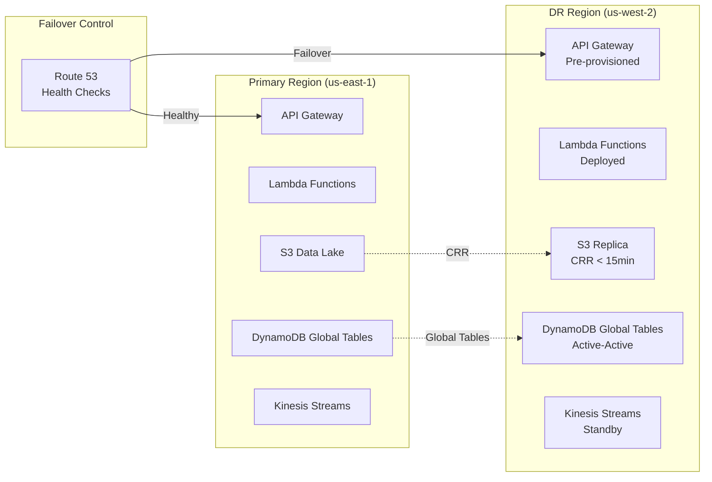

**Failover Procedure:**

| Step | Action | RTO Contribution |
|------|--------|-----------------|
| 1 | Route 53 health check fails (3 consecutive) | 30 seconds |
| 2 | Automated DNS failover to DR region | 60 seconds (TTL) |
| 3 | DR Lambda functions handle traffic (already deployed) | 0 seconds |
| 4 | DynamoDB Global Tables active (no promotion needed) | 0 seconds |
| 5 | Verify S3 CRR lag < 1 hour (RPO check) | 5 minutes |
| 6 | Activate DR Kinesis streams for new ingestion | 30 minutes |
| 7 | Start DR Glue jobs for pipeline continuity | 60 minutes |
| 8 | Verify end-to-end data flow | 30 minutes |
| **Total** | | **~2.5 hours (within 4h RTO)** |

### Blue-Green Deployment Pattern (LLD)

```mermaid
graph TB
    subgraph "Blue-Green Lambda Deployment"
        ALIAS[Lambda Alias: LIVE]
        V1[Version N<br/>Current (Blue)]
        V2[Version N+1<br/>New (Green)]
        
        ALIAS -->|95% traffic| V1
        ALIAS -->|5% canary| V2
    end

    subgraph "Rollback Decision"
        CW[CloudWatch Alarms<br/>Error Rate > 5%]
        CW -->|Alarm| ROLLBACK[Shift 100% → Blue]
        CW -->|OK after 10min| PROMOTE[Shift 100% → Green]
    end
```

```python
# deployment/blue_green.py
"""Blue-green deployment with automated rollback."""

class BlueGreenDeployer:
    """Manages Lambda alias traffic shifting with safety checks."""

    def deploy_canary(self, function_name: str, new_version: str, 
                     canary_percent: int = 5, bake_time_minutes: int = 10):
        """Deploy new version with canary traffic splitting."""
        self.lambda_client.update_alias(
            FunctionName=function_name,
            Name='LIVE',
            FunctionVersion=new_version,
            RoutingConfig={
                'AdditionalVersionWeights': {new_version: canary_percent / 100}
            }
        )
        # Monitor error rate during bake time
        # Rollback if error_rate > 5%
        ...

    def promote(self, function_name: str, new_version: str):
        """Promote green to 100% traffic."""
        ...

    def rollback(self, function_name: str, stable_version: str):
        """Emergency rollback to blue version."""
        ...
```


---

## Testing Strategy

### Why Property-Based Testing Does NOT Apply

This platform is primarily **Infrastructure as Code (Terraform)**, **AWS managed service configuration**, and **side-effect-heavy operations** (writing to S3, invoking SageMaker endpoints, sending messages to queues). These characteristics make property-based testing inappropriate:

1. **IaC is declarative configuration** — Terraform modules define desired state, not functions with inputs/outputs
2. **AWS service interactions are side-effects** — Lambda functions invoke external services, not pure transformations
3. **Most acceptance criteria test infrastructure wiring** — verifying that S3 lifecycle policies are configured correctly, not that algorithms produce correct outputs
4. **Cost of 100 iterations is prohibitive** — each test would require real AWS service calls

Instead, the platform uses the following complementary testing approaches:

### Testing Pyramid

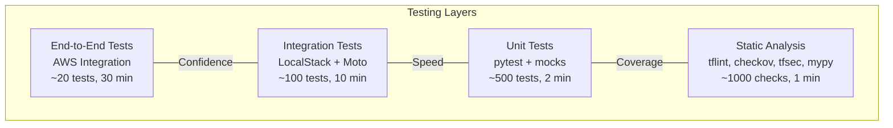

### Testing Strategy by Component

| Component | Test Type | Tools | Focus |
|-----------|-----------|-------|-------|
| Terraform Modules | Plan validation + Security scan | `terraform validate`, `tflint`, `checkov`, `tfsec` | No high-severity findings, valid HCL, security compliance |
| Lambda Functions | Unit tests + Integration tests | `pytest`, `moto`, `localstack` | Business logic, error handling, idempotency |
| Glue PySpark Jobs | Unit tests + Data quality | `pytest`, `pyspark` (local), `great_expectations` | Transformation logic, schema validation, dedup |
| API Gateway | Contract tests + Load tests | `schemathesis` (OpenAPI), `locust` | Schema compliance, rate limiting, auth |
| EventBridge | Integration tests | `localstack`, `moto` | Event routing, schema validation, delivery |
| Step Functions | State machine tests | `stepfunctions-local`, `pytest` | State transitions, error handling, retries |
| SageMaker | Model validation + Bias tests | `pytest`, `sagemaker SDK`, `SHAP` | Accuracy, fairness, latency, governance |
| OpenSearch | Index validation + Query tests | `opensearch-py`, `pytest` | Mapping correctness, query performance |
| Neptune | Graph model tests | `gremlinpython`, `pytest` | Traversal correctness, fraud pattern detection |
| Security | Policy validation + Compliance | `checkov`, `AWS Config`, `SecurityHub` | IAM least-privilege, encryption, audit trail |

### Terraform Testing (LLD)

```python
# tests/terraform/test_data_lake_module.py
"""Terraform module tests using terraform plan output validation."""
import pytest
import json
import subprocess

class TestDataLakeModule:
    """Validate data lake Terraform module configuration."""

    @pytest.fixture
    def terraform_plan(self):
        """Generate Terraform plan as JSON for inspection."""
        result = subprocess.run(
            ["terraform", "plan", "-out=tfplan", "-var-file=test.tfvars"],
            capture_output=True, cwd="terraform/modules/data-lake"
        )
        plan_json = subprocess.run(
            ["terraform", "show", "-json", "tfplan"],
            capture_output=True, cwd="terraform/modules/data-lake"
        )
        return json.loads(plan_json.stdout)

    def test_s3_buckets_have_encryption(self, terraform_plan):
        """All S3 buckets must use KMS encryption."""
        s3_resources = [r for r in terraform_plan["planned_values"]["root_module"]["resources"]
                       if r["type"] == "aws_s3_bucket"]
        for bucket in s3_resources:
            assert "server_side_encryption_configuration" in bucket["values"]

    def test_s3_buckets_have_versioning(self, terraform_plan):
        """Bronze layer buckets must have versioning enabled."""
        ...

    def test_s3_object_lock_compliance_mode(self, terraform_plan):
        """Regulatory buckets must use COMPLIANCE mode object lock."""
        ...

    def test_no_wildcard_iam_resources(self, terraform_plan):
        """No IAM policies use wildcard (*) resource in production."""
        iam_policies = [r for r in terraform_plan["planned_values"]["root_module"]["resources"]
                       if r["type"] == "aws_iam_policy"]
        for policy in iam_policies:
            statements = json.loads(policy["values"]["policy"])["Statement"]
            for stmt in statements:
                assert stmt.get("Resource") != "*", \
                    f"Wildcard resource in policy: {policy['name']}"

    def test_mandatory_tags_present(self, terraform_plan):
        """All resources must have mandatory tags."""
        mandatory_tags = ["Environment", "Service", "Owner", "CostCenter", 
                         "DataClassification", "Compliance"]
        for resource in terraform_plan["planned_values"]["root_module"]["resources"]:
            if "tags" in resource.get("values", {}):
                for tag in mandatory_tags:
                    assert tag in resource["values"]["tags"]

    def test_no_public_s3_buckets(self, terraform_plan):
        """No S3 buckets allow public access."""
        ...

    def test_vpc_endpoints_configured(self, terraform_plan):
        """Required VPC endpoints exist for all AWS services."""
        ...
```

### Lambda Function Unit Tests (LLD)

```python
# tests/unit/test_market_data_processor.py
"""Unit tests for Market Data Ingestion Service."""
import pytest
from unittest.mock import MagicMock, patch
from datetime import datetime
from decimal import Decimal

class TestMarketDataProcessor:
    """Test market data validation, enrichment, and routing."""

    @pytest.fixture
    def processor(self):
        with patch('boto3.client'):
            return MarketDataProcessor()

    @pytest.fixture
    def valid_bloomberg_record(self):
        return {
            "source_id": "bloomberg_bpipe",
            "instrument_id": "US0378331005",
            "instrument_type": "EQUITY",
            "bid_price": "150.25",
            "ask_price": "150.30",
            "last_price": "150.27",
            "volume": 1000000,
            "source_timestamp": "2024-01-15T14:30:00Z"
        }

    def test_valid_record_enriched_with_metadata(self, processor, valid_bloomberg_record):
        """Valid records get enriched with ingestion timestamp and partition key."""
        result = processor.process_record(valid_bloomberg_record)
        assert result.ingestion_ts is not None
        assert result.partition_key == "bloomberg_bpipe/EQUITY/2024-01-15"
        assert result.schema_version is not None

    def test_malformed_record_routed_to_dlq(self, processor):
        """Records failing schema validation go to dead-letter queue."""
        malformed = {"source_id": "bloomberg_bpipe"}  # Missing required fields
        with pytest.raises(ValidationError):
            processor.process_record(malformed)

    def test_dedup_key_derived_correctly(self, processor, valid_bloomberg_record):
        """Dedup key is composite of instrument_id + timestamp + source."""
        result = processor.process_record(valid_bloomberg_record)
        expected_key = hash("US0378331005|2024-01-15T14:30:00Z|bloomberg_bpipe")
        assert result.dedup_key is not None

    def test_batch_write_produces_parquet(self, processor):
        """Micro-batch writes valid Parquet to S3 Bronze."""
        ...

    def test_partition_registered_in_glue_catalog(self, processor):
        """New partitions trigger Glue Data Catalog registration."""
        ...


# tests/unit/test_order_manager.py
"""Unit tests for Order Manager Service."""

class TestOrderManager:
    """Test order validation, execution, and idempotency."""

    def test_idempotent_order_returns_cached_response(self):
        """Duplicate order with same idempotency key returns cached result."""
        ...

    def test_margin_check_rejects_insufficient_funds(self):
        """Orders exceeding available margin are rejected."""
        ...

    def test_trade_event_emitted_on_execution(self):
        """Successful execution emits trade.executed to EventBridge."""
        ...

    def test_invalid_instrument_rejected(self):
        """Orders for non-existent instruments are rejected with clear error."""
        ...


# tests/unit/test_advisory_agent.py
"""Unit tests for Advisory Agent Service."""

class TestAdvisoryAgent:
    """Test recommendation generation and governance."""

    def test_low_confidence_flagged_for_review(self):
        """Recommendations with confidence < 0.7 require human review."""
        ...

    def test_all_recommendations_logged_to_regulatory_store(self):
        """Every recommendation is persisted for FINRA audit compliance."""
        ...

    def test_model_version_included_in_response(self):
        """Response includes the model version used for inference."""
        ...

    def test_inference_timeout_returns_error(self):
        """SageMaker timeout produces structured error response."""
        ...
```

### Integration Tests (LLD)

```python
# tests/integration/test_pipeline_e2e.py
"""End-to-end pipeline integration tests using LocalStack."""
import pytest
import boto3
from testcontainers.localstack import LocalStackContainer

@pytest.fixture(scope="session")
def localstack():
    """Spin up LocalStack for AWS service mocking."""
    with LocalStackContainer(image="localstack/localstack:3.0") as container:
        yield container

@pytest.fixture
def s3_client(localstack):
    return boto3.client('s3', endpoint_url=localstack.get_url())

class TestBronzeToSilverPipeline:
    """Integration test: data flows correctly through Bronze → Silver."""

    def test_valid_data_transforms_to_silver(self, s3_client):
        """Valid Bronze data produces correct Silver Parquet output."""
        # Arrange: Upload test data to Bronze bucket
        # Act: Trigger ETL job
        # Assert: Silver bucket contains validated Parquet
        ...

    def test_invalid_records_routed_to_error_partition(self, s3_client):
        """Records failing validation land in _errors/ partition."""
        ...

    def test_deduplication_removes_exact_duplicates(self, s3_client):
        """Duplicate records (same instrument+timestamp+source) are removed."""
        ...


class TestEventDrivenFlow:
    """Integration test: events route correctly through EventBridge."""

    def test_data_ingested_triggers_etl_orchestration(self, localstack):
        """data.ingested event starts Step Functions execution."""
        ...

    def test_pipeline_failed_triggers_alarm(self, localstack):
        """pipeline.failed event creates CloudWatch alarm."""
        ...
```

### Security and Compliance Testing (LLD)

```python
# tests/security/test_iam_policies.py
"""Security tests: validate least-privilege IAM policies."""

class TestIAMCompliance:
    """Ensure all IAM policies follow least-privilege principles."""

    def test_no_admin_access_policies(self):
        """No service role has AdministratorAccess or PowerUser."""
        ...

    def test_all_roles_have_permission_boundaries(self):
        """All service roles are constrained by permission boundaries."""
        ...

    def test_no_cross_account_assume_without_external_id(self):
        """Cross-account trust requires ExternalId condition."""
        ...

# tests/security/test_encryption.py
class TestEncryptionCompliance:
    """Verify all data is encrypted at rest and in transit."""

    def test_all_s3_buckets_kms_encrypted(self):
        """Every S3 bucket uses CMK encryption, not default SSE."""
        ...

    def test_kms_key_rotation_enabled(self):
        """All CMKs have annual automatic rotation configured."""
        ...

    def test_tls_minimum_version(self):
        """All endpoints enforce TLS 1.3 minimum."""
        ...
```

### CI/CD Pipeline Testing Flow

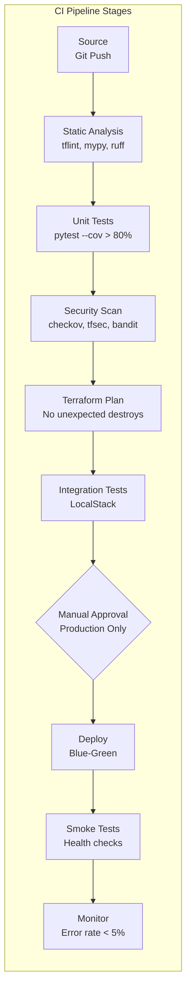

### Scale Testing Parameters

| Test Scenario | Load Profile | Duration | Success Criteria |
|--------------|-------------|----------|-----------------|
| Sustained ingestion | 1,157 rec/sec (average) | 24 hours | Zero data loss, <5s latency |
| Burst ingestion | 12,000 rec/sec (10x) | 15 minutes | Auto-scale, no throttling |
| API load test | 10,000 req/sec | 1 hour | P99 <500ms, 0% 5xx |
| ETL batch processing | 500 GB input | 60 minutes | Complete within SLA |
| Concurrent queries | 100 Athena queries | 30 minutes | All complete, cost within limits |
| Failover drill | Region failure simulation | 4 hours | RTO met, RPO verified |

### Monitoring and Observability Testing

```python
# tests/monitoring/test_alarms.py
"""Verify CloudWatch alarms fire correctly for all failure modes."""

class TestAlarmConfiguration:
    """Ensure alarms are configured for all SLA-critical paths."""

    REQUIRED_ALARMS = [
        "pipeline-latency-sla-breach",
        "api-error-rate-above-1pct",
        "lambda-throttling-detected",
        "sqs-depth-above-10k",
        "infrastructure-cpu-above-80pct",
        "cdc-replication-lag-above-60s",
        "kinesis-iterator-age-above-5s",
        "glue-job-failure",
        "cost-budget-80pct-threshold",
    ]

    def test_all_critical_alarms_exist(self):
        """All required alarms are defined in Terraform."""
        ...

    def test_alarm_actions_configured(self):
        """All alarms have SNS action for PagerDuty notification."""
        ...

    def test_alarm_evaluation_periods(self):
        """Alarms use appropriate evaluation periods (not too sensitive)."""
        ...
```

---

## Appendix: Scale Design Reference

### Capacity Planning

| Dimension | Current | Growth (2yr) | Design Capacity |
|-----------|---------|-------------|-----------------|
| Daily ingestion volume | 100M records | 200M records | 300M records |
| Raw data per day | 200-500 GB | 500 GB-1 TB | 1.5 TB |
| Total data estate | 10 PB | 25 PB | 30 PB |
| Monthly active users | 200M | 400M | 500M |
| Peak API requests/sec | 10,000 | 25,000 | 50,000 |
| Concurrent WebSocket | 50,000 | 100,000 | 150,000 |

### Lambda Concurrency Reservation

| Function | Reserved | Provisioned | Rationale |
|----------|----------|-------------|-----------|
| Market Data Ingestion | 2,000 | 500 | High burst, latency-sensitive |
| Trade Processing | 1,000 | 200 | Order execution SLA |
| Advisory Agent | 500 | 100 | SageMaker endpoint warm |
| API Handlers (general) | 1,000 | 0 | On-demand scaling |
| ETL Triggers | 200 | 0 | Async, not latency-sensitive |
| DLQ Processors | 100 | 0 | Background processing |

### Cost Optimization Strategy

| Strategy | Component | Projected Savings |
|----------|-----------|------------------|
| S3 Intelligent-Tiering | 10 PB data estate | 40-60% storage cost reduction |
| Spot Instances for Glue | Non-critical ETL jobs | 60% compute savings |
| Reserved Capacity | Neptune, OpenSearch | 30-40% vs on-demand |
| Lambda Graviton2 (ARM) | All functions | 20% cost + 34% performance |
| Athena query caching | Repeated analytical queries | 50% reduction in scans |
| DynamoDB on-demand | Low-traffic tables | Pay only for actual usage |


---

## Aurora PostgreSQL — Transactional Ledger (ACID Source of Truth)

### High-Level Design

Aurora PostgreSQL Multi-AZ serves as the **single source of truth** for all transactional trading data. It is the strongly-consistent write path that:
- Processes all order submissions (INSERT into orders table)
- Manages wallet/account balances (UPDATE with transaction isolation)
- Records trade executions (INSERT with foreign key integrity)
- Provides the source for DMS CDC pipeline to the data lake

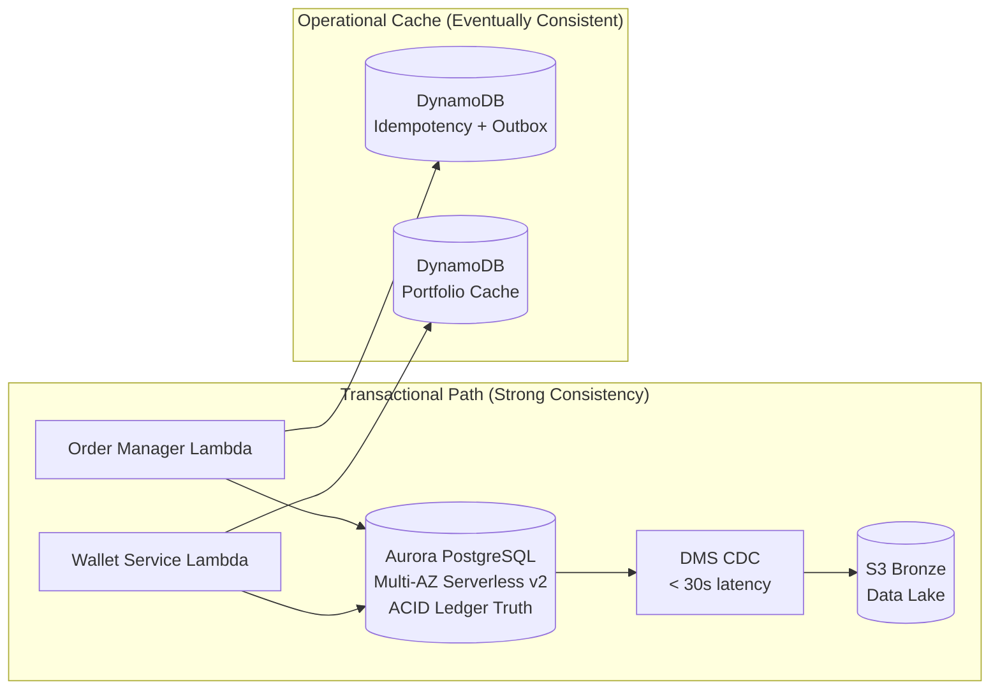

**Design Decision**: Aurora PostgreSQL is chosen over DynamoDB as the ledger because:
1. Multi-table ACID transactions (order + wallet + position in one commit)
2. SQL JOINs for reconciliation and regulatory reporting
3. Logical replication (CDC) for clean downstream decoupling
4. FINRA requires auditable, relational transaction history
5. Foreign key constraints enforce data integrity at the database level

### Low-Level Design

#### Aurora Cluster Configuration

| Parameter | Value | Rationale |
|-----------|-------|-----------|
| Engine | Aurora PostgreSQL 15.4 | Latest LTS with logical replication |
| Mode | Serverless v2 | Auto-scales 2-64 ACUs based on trading load |
| Topology | 1 Writer + 2 Readers | Writer for orders, readers for portfolio queries |
| Storage | I/O Optimized (aurora-iopt1) | High-throughput trading workload |
| Encryption | KMS CMK (Restricted) | FINRA compliance |
| Backup | 35-day retention | Maximum PITR window |
| Networking | Private subnets only | No public access |
| Access | Lambda (5432) + DMS (5432) | Security group restricted |

#### Database Schema (Trading Schema)

```sql
-- Core trading tables in Aurora PostgreSQL
CREATE SCHEMA trading;

CREATE TABLE trading.orders (
    order_id UUID PRIMARY KEY DEFAULT gen_random_uuid(),
    client_id VARCHAR(64) NOT NULL,
    account_id VARCHAR(64) NOT NULL,
    instrument_id VARCHAR(12) NOT NULL,  -- ISIN
    order_type VARCHAR(10) NOT NULL,     -- MARKET|LIMIT|STOP|STOP_LIMIT
    side VARCHAR(4) NOT NULL,            -- BUY|SELL
    quantity NUMERIC(20,6) NOT NULL CHECK (quantity > 0),
    limit_price NUMERIC(20,8),
    stop_price NUMERIC(20,8),
    time_in_force VARCHAR(3) NOT NULL,   -- DAY|GTC|IOC|FOK
    status VARCHAR(10) NOT NULL DEFAULT 'PENDING',
    executed_price NUMERIC(20,8),
    executed_quantity NUMERIC(20,6),
    idempotency_key VARCHAR(128) UNIQUE NOT NULL,
    correlation_id VARCHAR(64),
    created_at TIMESTAMPTZ NOT NULL DEFAULT NOW(),
    updated_at TIMESTAMPTZ NOT NULL DEFAULT NOW()
);

CREATE TABLE trading.wallets (
    account_id VARCHAR(64) NOT NULL,
    client_id VARCHAR(64) NOT NULL,
    cash_balance NUMERIC(20,8) NOT NULL DEFAULT 0,
    margin_available NUMERIC(20,8) NOT NULL DEFAULT 0,
    total_value NUMERIC(20,8) NOT NULL DEFAULT 0,
    last_updated TIMESTAMPTZ NOT NULL DEFAULT NOW(),
    PRIMARY KEY (account_id, client_id)
);

CREATE TABLE trading.positions (
    account_id VARCHAR(64) NOT NULL,
    instrument_id VARCHAR(12) NOT NULL,
    quantity NUMERIC(20,6) NOT NULL DEFAULT 0,
    avg_cost_basis NUMERIC(20,8) NOT NULL DEFAULT 0,
    market_value NUMERIC(20,8) NOT NULL DEFAULT 0,
    unrealized_pnl NUMERIC(20,8) NOT NULL DEFAULT 0,
    last_updated TIMESTAMPTZ NOT NULL DEFAULT NOW(),
    PRIMARY KEY (account_id, instrument_id)
);

CREATE TABLE trading.trade_executions (
    trade_id UUID PRIMARY KEY DEFAULT gen_random_uuid(),
    order_id UUID NOT NULL REFERENCES trading.orders(order_id),
    client_id VARCHAR(64) NOT NULL,
    account_id VARCHAR(64) NOT NULL,
    instrument_id VARCHAR(12) NOT NULL,
    side VARCHAR(4) NOT NULL,
    quantity NUMERIC(20,6) NOT NULL,
    executed_price NUMERIC(20,8) NOT NULL,
    total_value NUMERIC(20,8) NOT NULL,
    fees NUMERIC(20,8) NOT NULL DEFAULT 0,
    venue VARCHAR(64),
    execution_timestamp TIMESTAMPTZ NOT NULL DEFAULT NOW(),
    settlement_date DATE NOT NULL
);

-- Indexes for CDC and query performance
CREATE INDEX idx_orders_client ON trading.orders(client_id, created_at DESC);
CREATE INDEX idx_orders_status ON trading.orders(status, created_at);
CREATE INDEX idx_positions_account ON trading.positions(account_id);
CREATE INDEX idx_executions_client ON trading.trade_executions(client_id, execution_timestamp DESC);
CREATE INDEX idx_executions_instrument ON trading.trade_executions(instrument_id, execution_timestamp DESC);

-- Enable logical replication for DMS CDC
ALTER SYSTEM SET wal_level = 'logical';
ALTER SYSTEM SET max_replication_slots = 10;
ALTER SYSTEM SET max_wal_senders = 10;
```

#### Transaction Pattern (Order Execution)

```python
# Atomic order execution in Aurora PostgreSQL
# This runs as a single ACID transaction — all succeed or all fail
async def execute_order_transaction(conn, order: OrderRequest) -> TradeExecution:
    """Execute order with full ACID guarantees across multiple tables."""
    async with conn.transaction():
        # 1. Check and reserve margin (SELECT FOR UPDATE — locks wallet row)
        wallet = await conn.fetchrow(
            "SELECT cash_balance, margin_available FROM trading.wallets "
            "WHERE account_id = $1 AND client_id = $2 FOR UPDATE",
            order.account_id, order.client_id
        )
        required_margin = order.quantity * order.limit_price * Decimal("0.5")
        if wallet['margin_available'] < required_margin:
            raise InsufficientMarginError(...)

        # 2. Insert order record
        order_id = await conn.fetchval(
            "INSERT INTO trading.orders (client_id, account_id, instrument_id, "
            "order_type, side, quantity, limit_price, time_in_force, status, "
            "idempotency_key) VALUES ($1,$2,$3,$4,$5,$6,$7,$8,'EXECUTED',$9) "
            "RETURNING order_id",
            order.client_id, order.account_id, order.instrument_id,
            order.order_type, order.side, order.quantity,
            order.limit_price, order.time_in_force, order.idempotency_key
        )

        # 3. Insert trade execution
        trade_id = await conn.fetchval(
            "INSERT INTO trading.trade_executions (order_id, client_id, "
            "account_id, instrument_id, side, quantity, executed_price, "
            "total_value, fees, venue, settlement_date) "
            "VALUES ($1,$2,$3,$4,$5,$6,$7,$8,$9,$10,$11) RETURNING trade_id",
            order_id, order.client_id, order.account_id,
            order.instrument_id, order.side, order.quantity,
            order.limit_price, order.quantity * order.limit_price,
            Decimal("0"), "NYSE", date.today() + timedelta(days=1)
        )

        # 4. Update position (upsert)
        await conn.execute(
            "INSERT INTO trading.positions (account_id, instrument_id, quantity, avg_cost_basis) "
            "VALUES ($1, $2, $3, $4) "
            "ON CONFLICT (account_id, instrument_id) DO UPDATE SET "
            "quantity = positions.quantity + $3, "
            "avg_cost_basis = (positions.quantity * positions.avg_cost_basis + $3 * $4) "
            "/ (positions.quantity + $3), "
            "last_updated = NOW()",
            order.account_id, order.instrument_id, order.quantity, order.limit_price
        )

        # 5. Debit wallet
        await conn.execute(
            "UPDATE trading.wallets SET "
            "cash_balance = cash_balance - $1, "
            "margin_available = margin_available - $2, "
            "last_updated = NOW() "
            "WHERE account_id = $3 AND client_id = $4",
            order.quantity * order.limit_price, required_margin,
            order.account_id, order.client_id
        )

        # All 5 operations commit atomically — or all roll back
        return TradeExecution(trade_id=trade_id, order_id=order_id, ...)
```

### Consistency, Failure, and Recovery

| Capability | Aurora PostgreSQL Role |
|-----------|----------------------|
| Order + wallet ledger | Strong consistency, ACID transactions, foreign keys |
| Idempotency | UNIQUE constraint on idempotency_key (database-level dedup) |
| Reconciliation | SQL JOINs across orders, executions, positions, wallets |
| CDC to data lake | Logical replication → DMS → S3 Bronze (< 30s latency) |
| Recovery | RTO 5-15 min via Aurora failover; RPO near-zero (synchronous) |
| Regulatory audit | Full transaction history with timestamps for FINRA |


---

## Microservices Architecture & Design Patterns

### Service Inventory (7 Bounded Contexts)

| # | Service | Domain | Database | Communication |
|---|---------|--------|----------|---------------|
| 1 | Market Data Processor | Ingestion | S3 Bronze (own), Glue Catalog | Kinesis consumer → EventBridge producer |
| 2 | Order Manager | Trading | Aurora (orders, executions) + DynamoDB (outbox) | API Gateway → EventBridge producer |
| 3 | Wallet Service | Portfolio | Aurora (wallets, positions) + DynamoDB (cache) | SQS FIFO consumer + API Gateway |
| 4 | Advisory Agent | Recommendations | SageMaker Endpoint + S3 Regulatory Store | API Gateway → EventBridge producer |
| 5 | DLQ Processor | Error Recovery | EventBridge + CloudWatch | SQS consumer → EventBridge producer |
| 6 | Outbox Publisher | Event Reliability | DynamoDB Streams → EventBridge | Stream consumer |
| 7 | CDC Schema Evolution | Data Integration | Glue Catalog | EventBridge event mediator |

### Domain-Driven Design (Bounded Contexts)

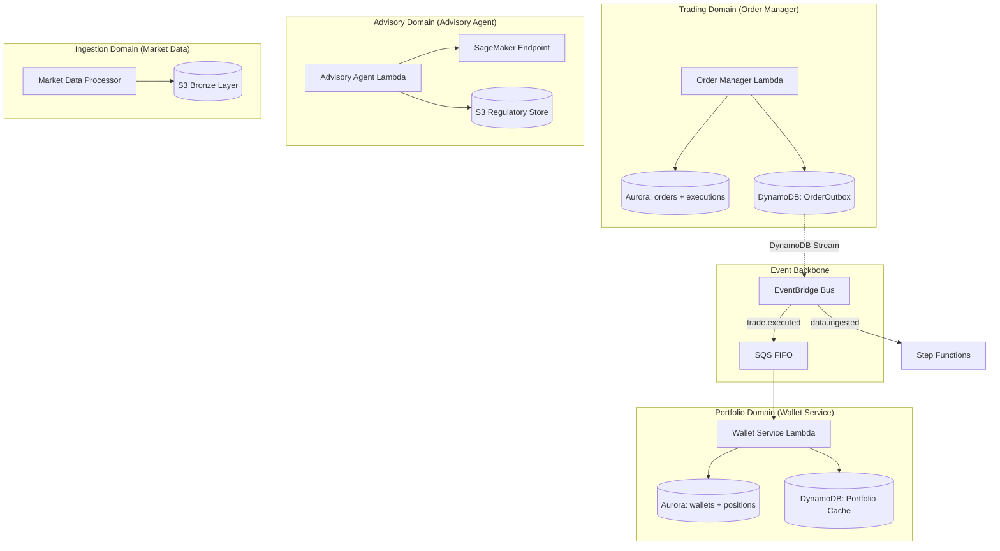

**Key principle**: Each domain owns its data. Services never directly query another service's database. All cross-domain communication happens through domain events.

**Exception**: Order Manager and Wallet Service share the Aurora cluster (same `trading` schema) because order execution requires ACID transactions across orders + wallets + positions in a single commit. Splitting into separate databases would require distributed transactions (2PC/Saga), which is inappropriate for financial ledger integrity.

---

## SOLID Principles Applied

### Single Responsibility Principle (SRP)

| Service | Single Responsibility |
|---------|----------------------|
| Market Data Processor | ONLY ingests and validates market data → writes to Bronze |
| Order Manager | ONLY handles order lifecycle (submit, validate, execute) |
| Wallet Service | ONLY manages portfolio state (positions, cash, margin) |
| Advisory Agent | ONLY generates recommendations via ML model |
| Outbox Publisher | ONLY reads DynamoDB Stream and publishes to EventBridge |
| DLQ Processor | ONLY processes dead-lettered messages (alerts + metrics) |

Each Lambda function does ONE thing. No service handles both ingestion and analytics, or both order execution and portfolio queries.

### Open/Closed Principle (OCP)

The platform is **open for extension, closed for modification**:
- **EventBridge schema registry**: New event types can be added without modifying existing services
- **Glue Data Catalog**: New tables can be registered without changing ETL code
- **Step Functions**: New orchestration steps can be added to the state machine without rewriting existing states
- **Data Quality rules**: New rules are added via `QualityRuleConfig` list — no changes to the `DataQualityEngine` class itself
- **SageMaker endpoint variants**: New model versions deployed via A/B split without changing Lambda code

### Liskov Substitution Principle (LSP)

- All Lambda handlers implement the same contract: `event → response`
- All event schemas conform to EventBridge envelope (source, detail-type, detail)
- SageMaker production and canary variants are interchangeable (same input/output contract)
- DynamoDB and Aurora both implement the same `Repository` interface pattern in the service code

### Interface Segregation Principle (ISP)

- **API Gateway routes**: Each endpoint exposes only what that consumer needs
  - `/v1/orders` — only order submission/retrieval (not portfolio)
  - `/v1/portfolio` — only portfolio queries (not order execution)
  - `/v1/advisory` — only recommendations (not trading)
- **IAM policies**: Each role has ONLY the permissions it needs (no shared wildcard roles)
- **Lake Formation**: Analysts see only Silver/Gold, not Bronze; PII columns excluded unless compliance role

### Dependency Inversion Principle (DIP)

- Lambda functions depend on **abstractions** (boto3 client interfaces), not concrete implementations
- `AdvisoryAgentService.__init__` accepts injected clients (for testing):
  ```python
  def __init__(self, sagemaker_client=None, eventbridge_client=None, 
               governance_engine=None, regulatory_store=None):
  ```
- `CircuitBreaker` accepts `table_name` parameter — not hardcoded to a specific DynamoDB table
- `DataQualityEngine` accepts `event_emitter` callable — decoupled from EventBridge

---

## Reliability Patterns (12-Factor + Cloud-Native)

### 1. Circuit Breaker Pattern

```python
# DynamoDB-backed distributed circuit breaker
# Shared state across all Lambda instances via DynamoDB

States:  CLOSED ──(5 failures)──► OPEN ──(60s timeout)──► HALF_OPEN ──(3 successes)──► CLOSED
                                    │                         │
                                    │                    (any failure)
                                    │                         │
                                    ◄─────────────────────────┘

Configuration:
  failure_threshold = 5        # Failures to trip circuit
  recovery_timeout = 60s       # Wait before probe
  success_threshold = 3        # Successes to close
  table = CircuitBreakerState  # DynamoDB (shared across all Lambda invocations)

Applied to:
  - SageMaker endpoint calls (Advisory Agent)
  - External market data provider connections
  - DMS replication monitoring
```

**Why DynamoDB-backed** (not in-memory): Lambda functions are stateless and scale to thousands of instances. The circuit state MUST be shared across all concurrent executions — in-memory state would only protect a single instance.

### 2. Eventual Consistency Model

| Data Path | Consistency | Staleness Budget | Reconciliation |
|-----------|-------------|------------------|----------------|
| Order → Aurora ledger | **Strong** (ACID) | 0 (synchronous) | N/A — single truth |
| Aurora → S3 Bronze (CDC) | Eventual | < 30 seconds | DMS lag metric + alarm |
| Bronze → Silver (ETL) | Eventual | < 60 minutes | Lineage record counts |
| Silver → Gold (ETL) | Eventual | < 30 minutes | Referential integrity check |
| Gold → OpenSearch | Eventual | < 10 minutes | Index lag metric |
| Gold → Neptune | Eventual | < 15 minutes | Bulk load completion check |
| DynamoDB Portfolio cache | Eventual | < 5 seconds (SQS FIFO) | Periodic Aurora reconciliation |

**Rule**: The ORDER LEDGER is always strongly consistent. Everything downstream is eventually consistent with monitored staleness budgets. Each boundary has a reconciliation mechanism.

### 3. Sharding & Partitioning Strategy

| Service | Sharding Approach | Key | Scale |
|---------|-------------------|-----|-------|
| **Kinesis** | Shard-based (16 shards) | instrument_id hash | 12K rec/sec burst |
| **SQS FIFO** | Message Group ID | account_id | Ordered per-account |
| **DynamoDB** | Hash key distribution | idempotency_key / service_name | Unlimited (on-demand) |
| **Aurora** | Read replicas (no sharding) | N/A (single writer) | Serverless v2 auto-scale |
| **S3** | Hive partitioning | source/year/month/day/hour | Unlimited (prefix-based) |
| **OpenSearch** | Index shards (12) | trade_id hash | 6 data nodes |
| **Neptune** | Internal graph partitioning | Vertex ID | Auto-scale readers |

**Kinesis Partition Key Strategy**:
```python
# Partition key = instrument_id ensures all records for same instrument 
# go to same shard → maintains ordering per instrument
partition_key = hashlib.md5(record['instrument_id'].encode()).hexdigest()
```

**Hot Partition Mitigation**:
- Kinesis ON_DEMAND mode auto-splits hot shards
- DynamoDB on-demand billing handles hot keys automatically
- OpenSearch uses 12 shards across 6 nodes for even distribution
- S3 prefix randomization via Hive partitioning (source/date/hour)

### 4. Rate Limiting & Throttling (Millions of Requests)

```
                    ┌─────────────────────────────────────────────┐
                    │         RATE LIMITING LAYERS                  │
                    │                                               │
                    │  Layer 1: API Gateway (10K req/sec per client)│
                    │     ├─ Authenticated: 10,000 req/sec         │
                    │     ├─ Unauthenticated: 100 req/sec          │
                    │     └─ Per-route: advisory=5K, graph=1K      │
                    │                                               │
                    │  Layer 2: Lambda Concurrency (Reserved)       │
                    │     ├─ Market Data: 2,000 concurrent         │
                    │     ├─ Order Manager: 1,000 concurrent       │
                    │     ├─ Advisory Agent: 500 concurrent        │
                    │     └─ Others: unreserved (account pool)     │
                    │                                               │
                    │  Layer 3: Aurora Connection Limits            │
                    │     ├─ Max connections alarm: 500            │
                    │     ├─ RDS Proxy (connection pooling)        │
                    │     └─ Serverless v2 auto-scales ACUs        │
                    │                                               │
                    │  Layer 4: DynamoDB On-Demand                  │
                    │     └─ No pre-provisioned capacity needed     │
                    │                                               │
                    │  Layer 5: Kinesis Back-pressure               │
                    │     ├─ Iterator age alarm (>5s = consumer lag)│
                    │     ├─ ON_DEMAND auto-splits shards          │
                    │     └─ Enhanced fan-out (dedicated 2MB/sec)   │
                    └─────────────────────────────────────────────┘
```

**Handling 200M Monthly Users (Peak: ~77K concurrent)**:
- API Gateway burst: 10,000 req/sec (burst limit)
- API Gateway sustained: 10,000 req/sec per route
- WebSocket: 5,000 concurrent connections
- Total Lambda concurrency: 2000 + 1000 + 500 = 3,500 reserved (plus unreserved pool)
- Kinesis: 16 shards × 1,000 rec/sec = 16,000 rec/sec write capacity
- Aurora Serverless v2: auto-scales 2→64 ACUs based on connections

### 5. Backpressure & Throttling Response

| Layer | Backpressure Signal | Response |
|-------|--------------------:|----------|
| API Gateway | HTTP 429 Too Many Requests | Retry-After header, client backs off |
| Lambda throttled | Event goes to DLQ after 3 retries | Alarm fires, SSM scales concurrency |
| Kinesis hot shard | WriteProvisionedThroughputExceeded | ON_DEMAND auto-splits shard |
| SQS queue depth >10K | CloudWatch alarm | Composite alarm triggers investigation |
| Aurora connections high | CloudWatch alarm at 500 | Serverless v2 scales up ACUs |
| DMS lag >60s | Replication lag alarm | Auto-scale DMS instance class |
| OpenSearch CPU >80% | CloudWatch alarm | Manual review (UltraWarm offload) |

### 6. Idempotency at Every Boundary

| Boundary | Idempotency Mechanism | Key |
|----------|----------------------|-----|
| API → Order Manager | `@idempotent` decorator (DynamoDB, 24h TTL) | Client-provided `idempotency_key` |
| Kinesis → Market Data | Sequence number deduplication | Kinesis sequence + shard ID |
| SQS FIFO → Wallet | Content-based deduplication + message dedup ID | Trade `order_id` |
| Glue ETL → Silver | Job bookmarks + dedup composite key | instrument_id + timestamp + source |
| DynamoDB Outbox → EventBridge | Outbox `published` flag | Outbox PK (OUTBOX#{uuid}) |
| Aurora → DMS → S3 | LSN-based checkpoint | Source log sequence number |

### 7. Retry Strategy (Exponential Backoff + Jitter)

```
Attempt 1: immediate
Attempt 2: wait 1s × 2^0 × jitter(0.5-1.5) = ~1s
Attempt 3: wait 1s × 2^1 × jitter(0.5-1.5) = ~2s
Attempt 4: (exhausted) → route to DLQ → emit pipeline.failed event → alert ops team

Max delay cap: 300s (5 minutes)
Retryable exceptions: ConnectionError, TimeoutError, ThrottlingException
Non-retryable: ValidationError, InsufficientMarginError, DataQualityAbortError
```

### 8. Failure Domains & Blast Radius

```
┌──────────────────────────────────────────────────────────────────┐
│ FAILURE DOMAIN ISOLATION                                          │
│                                                                   │
│ ┌─────────────┐  ┌─────────────┐  ┌─────────────┐               │
│ │ Trading     │  │ Analytics   │  │ ML/Advisory │  Independent   │
│ │ (Aurora +   │  │ (OpenSearch │  │ (SageMaker  │  failure       │
│ │  Lambda)    │  │  + Neptune  │  │  + S3)      │  domains       │
│ │             │  │  + Athena)  │  │             │                │
│ │ If this     │  │             │  │ If this     │                │
│ │ fails:      │  │ Can fail    │  │ fails:      │                │
│ │ - No new    │  │ independently│ │ - Advisory  │                │
│ │   orders    │  │ without     │  │   returns   │                │
│ │ - Existing  │  │ affecting   │  │   "unavail" │                │
│ │   positions │  │ trading or  │  │ - Trading   │                │
│ │   preserved │  │ ML advisory │  │   continues │                │
│ └─────────────┘  └─────────────┘  └─────────────┘               │
│                                                                   │
│ Event backbone (EventBridge + SQS) provides:                      │
│ - Buffering during failures (14-day SQS retention)                │
│ - Replay capability (Kinesis 7-day, EventBridge 30-day archive)   │
│ - Circuit breaker prevents cascade across domains                 │
└──────────────────────────────────────────────────────────────────┘
```

### 9. Performance Targets & Auto-Scaling

| Metric | Target | Auto-Scale Mechanism |
|--------|--------|---------------------|
| API latency P99 | < 500ms | Lambda provisioned concurrency (warm starts) |
| Order execution | < 30s timeout | Aurora Serverless v2 (2→64 ACUs) |
| Market data ingestion | < 5s to Bronze | Kinesis ON_DEMAND (auto-split) |
| Advisory recommendation | < 500ms P95 | SageMaker endpoint (1→10 instances) |
| ETL Bronze→Silver | < 60 min | Glue auto-scaling (10→100 DPUs) |
| ETL Silver→Gold | < 30 min | Glue auto-scaling (10→100 DPUs) |
| CDC replication | < 30s latency | DMS auto-scale instance class |
| Neptune graph query | < 5s (4 hops) | Auto-scale readers at 70% CPU |
| OpenSearch search | < 1s (P95) | 6 data nodes + UltraWarm offload |


---

## Error Handling & Observability Strategy

### Error Handling Philosophy

> "Every error is either **retryable** (transient) or **terminal** (permanent). Retryable errors get exponential backoff. Terminal errors get immediate DLQ routing, structured logging, and alerting. No error is ever swallowed silently."

### Error Classification Matrix

| Error Type | Category | Action | Example |
|-----------|----------|--------|---------|
| ConnectionError | Retryable | Backoff + retry (3x) | Network timeout to Aurora |
| TimeoutError | Retryable | Backoff + retry (3x) | SageMaker >500ms |
| ThrottlingException | Retryable | Backoff + retry (3x) | DynamoDB/Kinesis throttle |
| ValidationError | Terminal | Return 400 + log | Invalid order fields |
| InsufficientMarginError | Terminal | Return 422 + log | Not enough funds |
| InstrumentNotFoundError | Terminal | Return 404 + log | Bad ISIN/CUSIP |
| DataQualityAbortError | Terminal | Halt pipeline + DLQ + alert | >30% records fail quality |
| SchemaValidationError | Terminal (per record) | DLQ + continue batch | Malformed market data |
| CircuitOpenError | Terminal (temporary) | Return 503 + Retry-After | Downstream service down |

### Error Handling Per Layer

#### 1. API Gateway Layer (HTTP Errors)

```python
# Structured error response contract (all endpoints)
{
    "error": "ErrorType",           # Machine-readable error code
    "message": "Human description", # Safe for client display (no internals)
    "correlation_id": "uuid",       # For distributed tracing
    "retry_after": 5,               # Seconds (if retryable, e.g., 429/503)
    "details": [...]                # Field-level validation errors (400 only)
}

# HTTP status code mapping:
#   400 - ValidationError (bad input)
#   401 - JWT auth failure (expired/invalid token)
#   404 - Resource not found (order, instrument)
#   422 - Business rule violation (margin, position limit)
#   429 - Rate limit exceeded (Retry-After header)
#   500 - Unhandled internal error (alarm fires)
#   502 - Upstream service error (Aurora/SageMaker down)
#   503 - Circuit open (Retry-After header)
#   504 - Timeout (SageMaker >500ms, Aurora >30s)
```

#### 2. Database Layer (Aurora PostgreSQL)

```python
# Aurora error handling with connection pooling awareness
try:
    async with conn.transaction():
        # ACID operations...
except asyncpg.UniqueViolationError:
    # Idempotency key collision → return cached response (not an error)
    return get_cached_response(idempotency_key)
except asyncpg.ForeignKeyViolationError:
    # Data integrity issue → terminal, return 422
    raise BusinessRuleError("Referenced entity does not exist")
except asyncpg.ConnectionDoesNotExistError:
    # Connection pool exhausted → retryable with circuit breaker
    circuit_breaker.record_failure(error)
    raise RetryableError("Database connection unavailable")
except asyncpg.DeadlockDetectedError:
    # Transaction deadlock → automatic retry (up to 3x)
    raise RetryableError("Transaction conflict, retrying")
except asyncpg.QueryCanceledError:
    # Query timeout (>30s) → log and alert
    logger.error("Query timeout", query_id=query_id, duration_ms=elapsed)
    raise TimeoutError("Database query exceeded timeout")
```

#### 3. Kinesis / Streaming Layer (Message Processing)

```python
# Batch processing with partial failure reporting
# Lambda returns batchItemFailures — only failed records are retried

def lambda_handler(event, context):
    batch_item_failures = []
    
    for record in event['Records']:
        try:
            process_record(record)
        except SchemaValidationError as e:
            # Terminal per-record: route to DLQ, don't retry
            send_to_dlq(record, error=e)
            emit_error_event(e)
            # Do NOT add to batchItemFailures (don't retry malformed data)
        except (ConnectionError, TimeoutError) as e:
            # Retryable: add to failures → Kinesis will retry this record
            batch_item_failures.append({
                "itemIdentifier": record['kinesis']['sequenceNumber']
            })
        except Exception as e:
            # Unknown error: log, DLQ, don't retry (prevent poison pill)
            logger.exception("Unexpected error", record_id=record_id)
            send_to_dlq(record, error=e)
    
    return {"batchItemFailures": batch_item_failures}

# Kinesis event source mapping config:
#   bisect_batch_on_function_error = true  (split batch to isolate bad record)
#   maximum_retry_attempts = 3             (don't retry forever)
#   maximum_record_age_in_seconds = 86400  (skip records older than 24h)
#   on_failure → DLQ destination           (capture unprocessable records)
```

#### 4. SQS / EventBridge Layer (Async Messaging)

```python
# SQS FIFO with exactly-once + DLQ after maxReceiveCount

# Message processing:
#   - Success → message deleted from queue
#   - Failure → visibility timeout expires → message reappears
#   - After maxReceiveCount (5) failures → message moves to DLQ
#   - DLQ Processor: emit alert + metric + pipeline.failed event

# EventBridge delivery failure:
#   - Target unavailable → retry with exponential backoff (built-in)
#   - After exhaustion → message goes to EventBridge DLQ (SQS)
#   - CloudWatch alarm on DLQ depth > 0
```

#### 5. ETL Layer (Glue PySpark)

```python
# ETL error handling with data quality gates

class BronzeToSilverETL:
    def run(self):
        for attempt in range(1, MAX_RETRIES + 1):
            try:
                raw = self.extract()           # May fail: S3 access, partition not found
                valid, rejected = self.validate_schema(raw)  # Never fails, splits data
                deduped = self.deduplicate(valid)             # Never fails, reduces data
                passed, failed = self.apply_data_quality(deduped)  # May ABORT if >30%
                self.write_silver(passed)      # May fail: S3, KMS, disk
                self.write_lineage(...)        # Non-critical, log if fails
                self.emit_success_event()      # Non-critical, log if fails
                return  # SUCCESS
                
            except DataQualityAbortError as e:
                # NON-RETRYABLE: Bad data, not infrastructure
                self.emit_failure_event(e, attempt)
                raise  # Don't retry, escalate immediately
                
            except Exception as e:
                # RETRYABLE: Infrastructure issue
                if attempt < MAX_RETRIES:
                    backoff = 30 * (2 ** (attempt - 1))  # 30s, 60s, 120s
                    time.sleep(backoff)
                else:
                    self.emit_failure_event(e, attempt)
                    raise  # All retries exhausted → Step Functions catches
```

#### 6. ML/SageMaker Layer

```python
# SageMaker inference with timeout enforcement + graceful degradation

def invoke_sagemaker(profile):
    start = time.time()
    try:
        response = sagemaker_runtime.invoke_endpoint(
            EndpointName=endpoint_name,
            ContentType='application/json',
            Body=json.dumps(profile.to_features())
        )
    except sagemaker_runtime.exceptions.ModelError as e:
        # Model crashed → circuit breaker + alert
        circuit_breaker.record_failure(e)
        raise InternalServerError("Model inference failed")
    except ClientError as e:
        if e.response['Error']['Code'] == 'ThrottlingException':
            # Throttled → retryable
            raise RetryableError("SageMaker throttled")
        raise
    
    elapsed_ms = (time.time() - start) * 1000
    if elapsed_ms > 500:
        # SLA violation → log warning, still return result but alert
        logger.warning("SageMaker SLA breach", elapsed_ms=elapsed_ms)
        metrics.add_metric("SageMakerSLABreach", 1)
    
    return parse_response(response)
```

---

## Logging & Observability Architecture

### Structured Logging Standard (All Services)

```python
# Every log entry includes these fields (via Lambda Powertools):
{
    "level": "INFO|WARNING|ERROR",
    "timestamp": "2024-01-15T10:30:00.123Z",
    "service": "order-manager",                # Which microservice
    "function_name": "verticalbroker-prod-order-manager",
    "correlation_id": "abc-123-def-456",       # Traces across services
    "request_id": "lambda-request-id",         # Lambda invocation ID
    "xray_trace_id": "1-abc-def",              # X-Ray trace for distributed tracing
    "cold_start": false,                       # Lambda cold start indicator
    
    # Business context (varies per service):
    "order_id": "uuid",
    "client_id": "client-123",                 # Never log PII (name, SSN, account#)
    "instrument_id": "US0378331005",
    "action": "submit_order",
    "outcome": "ACCEPTED|REJECTED|ERROR",
    "duration_ms": 45,
    
    # Error context (when applicable):
    "error_type": "InsufficientMarginError",
    "error_message": "Required 50000, available 30000",
    "stack_trace": "..."                       # Only in ERROR level
}
```

### What We Log vs What We DON'T Log

| ✅ DO LOG | ❌ NEVER LOG |
|-----------|-------------|
| correlation_id, request_id | Client name, SSN, DOB |
| order_id, instrument_id | Account numbers, passwords |
| Error type + safe message | Raw SQL queries with data |
| Duration (ms), record counts | JWT tokens, API keys |
| Status codes, retry counts | Full request/response bodies with PII |
| DLQ routing reason | Credit card numbers |

### Observability Layers

```
┌─────────────────────────────────────────────────────────────────┐
│                    OBSERVABILITY STACK                            │
│                                                                   │
│  ┌─────────────────┐  ┌──────────────────┐  ┌───────────────┐  │
│  │    METRICS       │  │     LOGS          │  │    TRACES     │  │
│  │  (CloudWatch)    │  │ (CloudWatch Logs) │  │   (X-Ray)     │  │
│  │                  │  │                   │  │               │  │
│  │ - Invocations    │  │ - Structured JSON │  │ - 5% normal   │  │
│  │ - Errors         │  │ - 90-day retention│  │ - 100% errors │  │
│  │ - Duration       │  │ - Insights queries│  │ - 10% trades  │  │
│  │ - Throttles      │  │ - Metric filters  │  │               │  │
│  │ - Custom EMF     │  │ - Subscription    │  │ - Service map │  │
│  │   metrics        │  │   filters         │  │ - Latency     │  │
│  │                  │  │                   │  │   breakdown   │  │
│  └────────┬─────────┘  └────────┬──────────┘  └──────┬────────┘  │
│           │                      │                     │          │
│           ▼                      ▼                     ▼          │
│  ┌─────────────────────────────────────────────────────────────┐ │
│  │              ALARMS + DASHBOARDS + AUTOMATION                 │ │
│  │  9 Alarms → SNS (PagerDuty) → SSM Runbooks (auto-heal)      │ │
│  │  3 Composite Alarms → cascade failure detection              │ │
│  │  5 Dashboards → pipeline health, API, cost, security, ML    │ │
│  └─────────────────────────────────────────────────────────────┘ │
└─────────────────────────────────────────────────────────────────┘
```

### Custom Metrics (CloudWatch EMF via Lambda Powertools)

| Service | Custom Metric | Unit | Purpose |
|---------|--------------|------|---------|
| Market Data | RecordsWritten | Count | Throughput tracking |
| Market Data | MalformedRecords | Count | Data quality signal |
| Market Data | MicroBatchSizeBytes | Bytes | Batch efficiency |
| Order Manager | OrderAccepted / OrderRejected | Count | Conversion rate |
| Order Manager | TradeEventEmitted | Count | Event reliability |
| Wallet Service | PositionUpdated | Count | Processing rate |
| Wallet Service | MarginCheckPerformed | Count | Validation load |
| Advisory Agent | RecommendationGenerated | Count | ML utilization |
| Advisory Agent | HumanReviewFlagged | Count | Governance trigger rate |
| Advisory Agent | SageMakerLatencyMs | Milliseconds | SLA compliance |
| Advisory Agent | ConfidenceScore | None | Model quality signal |
| DLQ Processor | DeadLetteredMessages | Count | Failure rate |
| ETL | ProcessingDurationSeconds | Seconds | Pipeline SLA |
| ETL | RecordsInput/Output/Rejected | Count | Data flow health |

### Distributed Tracing (X-Ray)

```
Client Request → API Gateway → Lambda (Order Manager) → Aurora → DynamoDB → EventBridge
     │              │              │                       │          │           │
     │         [trace start]  [subsegment]           [subsegment] [subsegment] [subsegment]
     │                                                                           │
     │                                                        ┌──────────────────┘
     │                                                        ▼
     │                                               SQS FIFO → Lambda (Wallet) → DynamoDB
     │                                                              [new trace segment]
     │
     └── correlation_id links all traces across async boundaries
```

**Sampling Rules**:
- Normal traffic: 5% sampled (cost-effective for high volume)
- Error paths: 100% sampled (never miss a failure trace)
- Trade paths (/v1/orders): 10% sampled (critical path visibility)

### Log-Based Alerting (Metric Filters)

```hcl
# CloudTrail metric filters for security detection (<60s)
# These create CloudWatch metrics from log patterns:

# 1. Unauthorized API calls → alarm if 5+ in 60s
filter_pattern = "{ ($.errorCode = \"*UnauthorizedOperation\") || ($.errorCode = \"AccessDenied*\") }"

# 2. S3 data exfiltration → alarm if 100+ external GetObject in 60s  
filter_pattern = "{ ($.eventSource = \"s3.amazonaws.com\") && ($.eventName = \"GetObject\") && ($.sourceIPAddress != \"*.amazonaws.com\") }"

# 3. IAM policy changes → alarm on ANY change (privilege escalation)
filter_pattern = "{ ($.eventName = \"PutRolePolicy\") || ($.eventName = \"AttachRolePolicy\") || ... }"
```

### Correlation ID Propagation

```
API Gateway → Lambda → EventBridge → SQS → Lambda → DynamoDB
    │             │          │          │       │
    └─ X-Request-ID header propagated as correlation_id through all services
    
How it works:
1. API Gateway generates X-Request-ID (or uses client-provided)
2. Lambda Powertools injects as correlation_id into Logger
3. EventBridge events include correlation_id in detail payload
4. SQS messages carry correlation_id in message attributes
5. Downstream Lambda extracts and sets correlation_id in its Logger
6. CloudWatch Logs Insights: query by correlation_id across ALL log groups
```

### Observability Queries (CloudWatch Logs Insights)

```sql
-- Find all logs for a specific failed order (across all services)
fields @timestamp, @message, service, correlation_id, error_type
| filter correlation_id = "abc-123-def-456"
| sort @timestamp asc

-- Top errors in the last hour
fields service, error_type, @message
| filter level = "ERROR"
| stats count(*) as error_count by service, error_type
| sort error_count desc
| limit 20

-- P99 latency by service
fields service, duration_ms
| stats percentile(duration_ms, 99) as p99_ms by service

-- DLQ message analysis
fields original_queue, failure_reason, retry_count
| filter @logStream like "dlq-processor"
| stats count(*) by original_queue, failure_reason
| sort count desc
```


---

## Market Data Service — Connectivity Architecture

### How Bloomberg B-Pipe & Thomson Reuters Connect to the Platform

The Market Data Service has **two ingestion paths** — one for market data feeds (Bloomberg/Reuters) and one for client trading actions (Trader Interface via API Gateway):

```
┌─────────────────────────────────────────────────────────────────────────────┐
│                    MARKET DATA INGESTION PATHS                                │
│                                                                               │
│  PATH 1: Market Data Feeds (Bloomberg B-Pipe + Thomson Reuters)              │
│  ═══════════════════════════════════════════════════════════════              │
│                                                                               │
│  [Bloomberg B-Pipe]──►[AWS PrivateLink / Direct Connect]──►[Kinesis Agent   │
│                        (dedicated network connection)        on EC2 in VPC]   │
│                                                                    │          │
│  [Thomson Reuters] ──►[AWS PrivateLink / Direct Connect]──►[Kinesis Agent   │
│                        (dedicated network connection)        on EC2 in VPC]   │
│                                                                    │          │
│                                                                    ▼          │
│                                                        ┌────────────────────┐│
│                                                        │ Kinesis Data Stream ││
│                                                        │ 16 shards (12K/sec)││
│                                                        └─────────┬──────────┘│
│                                                                  │           │
│                                                                  ▼           │
│                                                   ┌──────────────────────┐   │
│                                                   │ Lambda: MarketData   │   │
│                                                   │ Processor (2000 conc)│   │
│                                                   └──────────┬───────────┘   │
│                                                              │               │
│                                         ┌────────────────────┼───────────┐   │
│                                         ▼                    ▼           ▼   │
│                                   [S3 Bronze]        [Glue Catalog]  [EventBridge]
│                                   (Parquet)          (partition reg)  (data.ingested)
│                                                                               │
│                                                                               │
│  PATH 2: Client Trading Actions (Trader Interface → API Gateway)             │
│  ════════════════════════════════════════════════════════════════             │
│                                                                               │
│  [Trader Interface]──►[API Gateway]──►[Lambda: OrderManager]──►[Aurora]      │
│  (Web/Mobile App)     (REST + WS)     (idempotent, ACID)       (ledger)      │
│                            │                    │                              │
│                            │                    ▼                              │
│                            │           [DynamoDB Outbox]──►[EventBridge]      │
│                            │                                (trade.executed)   │
│                            │                                     │            │
│                            ▼                                     ▼            │
│                  [Lambda: WalletService]              [SQS FIFO]──►[Wallet]   │
│                  [Lambda: AdvisoryAgent]              (position update)        │
│                                                                               │
│  WebSocket path (real-time market data TO clients):                           │
│  [Lambda: MarketData] ──► [EventBridge] ──► [WebSocket API] ──► [Clients]   │
│                                                                               │
└─────────────────────────────────────────────────────────────────────────────┘
```

### Bloomberg B-Pipe Connectivity (Detailed)

Bloomberg B-Pipe is a **server-side, low-latency market data feed** delivered via dedicated network connections:

```
┌──────────────────┐     ┌────────────────────┐     ┌────────────────────────┐
│  Bloomberg       │     │  Network Layer      │     │  AWS VPC (Private)      │
│  B-Pipe Server   │────►│                     │────►│                         │
│  (Bloomberg DC)  │     │  Option A:          │     │  EC2: Kinesis Agent     │
│                  │     │  AWS Direct Connect │     │  (Amazon Kinesis Agent  │
│  Protocol:       │     │  (1-10 Gbps, dedicated)  │   or custom Python)     │
│  - TCP/IP        │     │                     │     │                         │
│  - Bloomberg     │     │  Option B:          │     │  Receives: TCP stream   │
│    proprietary   │     │  AWS PrivateLink    │     │  Transforms: to JSON    │
│    (BLPAPI)      │     │  (VPC endpoint svc) │     │  Publishes: to Kinesis  │
│                  │     │                     │     │                         │
│  Data:           │     │  Option C:          │     │  Rate: 1,157/sec avg    │
│  - Quotes        │     │  Site-to-Site VPN   │     │        12,000/sec burst │
│  - Trades        │     │  (encrypted tunnel) │     │                         │
│  - News          │     │                     │     │                         │
└──────────────────┘     └────────────────────┘     └────────────┬───────────┘
                                                                  │
                                                                  ▼
                                                     ┌────────────────────────┐
                                                     │  Kinesis Data Stream    │
                                                     │  vb-market-data-prod    │
                                                     │  16 shards | ON_DEMAND  │
                                                     │  7-day retention        │
                                                     │  KMS encrypted          │
                                                     └────────────────────────┘
```

**Connection Options** (interview answer):

| Option | Use When | Latency | Cost |
|--------|----------|---------|------|
| **AWS Direct Connect** | Production (dedicated fiber, 1-10 Gbps) | <1ms to VPC | $$$$ |
| **AWS PrivateLink** | If Bloomberg offers VPC endpoint service | <2ms | $$$ |
| **Site-to-Site VPN** | Lower cost / backup path | 5-20ms | $$ |
| **Internet (TLS)** | Dev/test only | Variable | $ |

**For the interview**: "I would use AWS Direct Connect with a dedicated connection from Bloomberg's data center to our VPC. This provides <1ms latency, dedicated bandwidth (no contention), and stays on the AWS backbone — no internet traversal. A VPN serves as encrypted backup path for failover."

### Thomson Reuters (Refinitiv) Connectivity

Similar architecture but may use **Refinitiv Real-Time Distribution System (RTDS)**:

```
Thomson Reuters RTDS → Direct Connect → EC2 Agent → Kinesis → Lambda
```

Or **Refinitiv Data Platform (cloud-native API)**:
```
Refinitiv Cloud API → Lambda (HTTP polling / WebSocket) → Kinesis → Lambda
```

### EC2 Kinesis Agent (Feed Handler)

The feed handler runs on EC2 in the private VPC (not Lambda) because:
1. Bloomberg B-Pipe requires a **persistent TCP connection** (not request/response)
2. Lambda has 15-min timeout — market feeds run continuously during market hours
3. EC2 can maintain stateful connections with heartbeats and reconnection logic

```python
# src/services/market_data/feed_handler.py (runs on EC2, NOT Lambda)
"""
Bloomberg B-Pipe Feed Handler — EC2-based Kinesis Producer.

Maintains persistent TCP connection to Bloomberg B-Pipe server,
receives real-time market data, transforms to platform JSON format,
and publishes to Kinesis Data Stream.

Runs as a systemd service on EC2 instances in private data subnets.
Auto Scaling Group: min 2, max 4 (multi-AZ for HA).
"""

import asyncio
import json
from datetime import datetime, timezone
from decimal import Decimal

import boto3
from blpapi import Session, Event, Message  # Bloomberg API SDK

class BloombergFeedHandler:
    """Maintains persistent Bloomberg B-Pipe connection and publishes to Kinesis."""

    def __init__(self, kinesis_stream: str, region: str = "us-east-1"):
        self.kinesis = boto3.client("kinesis", region_name=region)
        self.stream_name = kinesis_stream
        self.session = None
        self.connected = False
        self.records_buffer = []
        self.BATCH_SIZE = 500  # Kinesis PutRecords max batch

    async def connect_bloomberg(self, host: str, port: int):
        """Establish persistent TCP connection to Bloomberg B-Pipe."""
        session_options = blpapi.SessionOptions()
        session_options.setServerHost(host)
        session_options.setServerPort(port)
        self.session = blpapi.Session(session_options)
        self.session.start()
        self.session.openService("//blp/mktdata")
        self.connected = True

    async def subscribe(self, instruments: list[str]):
        """Subscribe to market data for given instruments."""
        subscriptions = blpapi.SubscriptionList()
        for isin in instruments:
            subscriptions.add(isin, "LAST_PRICE,BID,ASK,VOLUME", "", blpapi.CorrelationId(isin))
        self.session.subscribe(subscriptions)

    async def process_events(self):
        """Main event loop — processes Bloomberg events continuously."""
        while self.connected:
            event = self.session.nextEvent(timeout=1000)
            if event.eventType() == blpapi.Event.SUBSCRIPTION_DATA:
                for msg in event:
                    record = self._transform_to_platform_format(msg)
                    self.records_buffer.append(record)
                    
                    if len(self.records_buffer) >= self.BATCH_SIZE:
                        await self._flush_to_kinesis()

    def _transform_to_platform_format(self, msg: Message) -> dict:
        """Transform Bloomberg message to VerticalBroker platform format."""
        return {
            "source_id": "bloomberg",
            "instrument_id": str(msg.correlationId().value()),
            "timestamp": datetime.now(timezone.utc).isoformat(),
            "bid_price": str(msg.getElementAsFloat("BID")),
            "ask_price": str(msg.getElementAsFloat("ASK")),
            "last_price": str(msg.getElementAsFloat("LAST_PRICE")),
            "volume": msg.getElementAsInteger("VOLUME"),
        }

    async def _flush_to_kinesis(self):
        """Batch publish buffered records to Kinesis Data Stream."""
        records = [
            {
                "Data": json.dumps(r).encode("utf-8"),
                "PartitionKey": r["instrument_id"],  # Same instrument → same shard
            }
            for r in self.records_buffer
        ]
        self.kinesis.put_records(StreamName=self.stream_name, Records=records)
        self.records_buffer = []
```

### Complete Data Flow (End-to-End)

```
MARKET DATA PATH (automated, continuous):
  Bloomberg B-Pipe ──[Direct Connect]──► EC2 Feed Handler ──► Kinesis (16 shards)
  Thomson Reuters  ──[Direct Connect]──► EC2 Feed Handler ──► Kinesis (16 shards)
                                                                     │
                                                                     ▼
                                                    Lambda: MarketDataProcessor
                                                    (validates, enriches, writes)
                                                                     │
                                              ┌──────────────────────┼──────────────┐
                                              ▼                      ▼              ▼
                                        S3 Bronze              Glue Catalog    EventBridge
                                        (Parquet)             (partition)    (data.ingested)
                                                                                    │
                                                                                    ▼
                                                                           Step Functions
                                                                        (ETL orchestrator)


CLIENT TRADING PATH (user-initiated, request/response):
  Trader Interface ──[HTTPS]──► API Gateway ──► Lambda: OrderManager ──► Aurora (ACID)
  (browser/mobile)              (JWT auth)      (validates order)          │
                                    │                                      ▼
                                    │                              DynamoDB Outbox
                                    │                                      │
                                    │                              DynamoDB Stream
                                    │                                      │
                                    │                                      ▼
                                    │                    Outbox Publisher Lambda
                                    │                                      │
                                    │                                      ▼
                                    │                              EventBridge
                                    │                          (trade.executed event)
                                    │                                      │
                                    ▼                                      ▼
                          Lambda: WalletService              SQS FIFO → Wallet Service
                          (portfolio query)                  (position update)


REAL-TIME MARKET DATA TO CLIENTS (push via WebSocket):
  S3 Bronze ──► Lambda ──► EventBridge ──► WebSocket API Gateway ──► Client browsers
  (new data)                (data.ingested)    (wss://market-data)     (subscribed)
```

### Key Interview Answer

> "Bloomberg B-Pipe and Thomson Reuters connect via **AWS Direct Connect** to EC2 feed handlers running in our private VPC. These maintain persistent TCP connections because market data is a continuous stream (not request/response). The feed handlers transform proprietary wire formats into platform JSON and batch-publish to **Kinesis** at up to 12,000 records/second.
>
> The **Trader Interface** connects via **API Gateway** (HTTPS + WebSocket). Trading actions (orders, portfolio queries, advisory requests) go through REST endpoints with JWT authentication. Real-time market data is pushed BACK to clients via the WebSocket API.
>
> These are **two separate ingestion paths** that converge in the event backbone (EventBridge). Market data flows to the data lake. Trade executions flow to the portfolio service. Both ultimately feed the Gold layer for analytics and ML."

### Why Not Lambda for Bloomberg/Reuters Feed Handling?

| Concern | Lambda | EC2 Feed Handler |
|---------|--------|-----------------|
| Persistent TCP connection | ❌ 15-min timeout | ✅ Runs continuously |
| Connection state (heartbeats) | ❌ Stateless | ✅ Maintains connection |
| Bloomberg BLPAPI SDK | ❌ Complex in Lambda | ✅ Standard deployment |
| Reconnection on network blip | ❌ Cold start penalty | ✅ Immediate reconnect |
| Cost (24/7 during market hours) | ❌ Expensive at sustained throughput | ✅ Reserved instances |

**However**: Lambda IS used for the **processing** step (MarketDataProcessor) because:
- It's triggered by Kinesis (event-driven, auto-scales)
- Each invocation is short (process batch → write Parquet → done)
- No persistent connections needed
- Scales to 2,000 concurrent for burst handling

